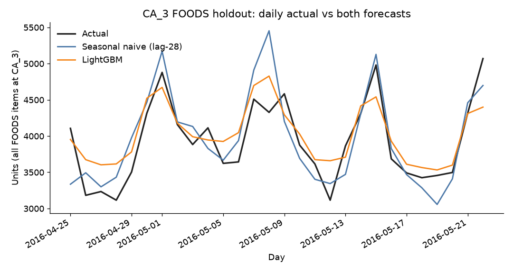

# Demand Forecasting — Walmart M5

## Executive summary

**Business question.** How many food units will Walmart store CA_3 sell, item by item, over the next 28 days, and does LightGBM beat a same-weekday-four-weeks-ago copy?

**Result.** On the holdout 2016-04-25 through 2016-05-22 (1,437 FOODS series, 40,236 item-days, 109,870 actual units), LightGBM’s WAPE is **64.9%** and the lag-28 seasonal naive’s WAPE is **77.7%**. MAPE, only on days with actual sales, is 56.3% versus 87.8%. Both forecasts are high (LightGBM +2.6%, lag-28 +1.1%). A high forecast means extra inventory, not stockouts. LightGBM wins WAPE and MAPE and loses on bias.

**Recommendation.** Use LightGBM for CA_3 food replenishment planning. Keep the lag-28 forecast as the benchmark. Do not claim dollar savings. No dollar figure was calculated.

**Not in this result.** Other stores, HOUSEHOLD, HOBBIES, and inventory policy (project 02). On item FOODS_3_090 the baseline WAPE 0.1975 beats LightGBM 0.2130 (250,502 training units, 3,357 holdout units).

## Reports, chart, and code

| | |
|---|---|
| Plan | [reports/01-plan.md](reports/01-plan.md) |
| Analyze | [reports/02-analyze.md](reports/02-analyze.md) |
| Construct | [reports/03-construct.md](reports/03-construct.md) |
| Execute | [reports/04-execute.md](reports/04-execute.md) |
| Business report | [reports/business-report.md](reports/business-report.md) |
| Chart | [images/ca3_foods_forecast_vs_actual.png](images/ca3_foods_forecast_vs_actual.png) |
| Dashboard | [dashboards/ca3_foods_dashboard.html](dashboards/ca3_foods_dashboard.html) (open the file; GitHub will show the source) |
| Code | [src/analyze_ca.py](src/analyze_ca.py), [src/construct_forecast.py](src/construct_forecast.py) |

The dashboard is a static HTML page. Publishing to Tableau Public is a manual step: import `data/processed/ca3_foods_holdout_predictions.csv`. This repo was not signed into Tableau.

## Data
See [`data/README.md`](data/README.md) for source, license, and file inventory.

## Approach (PACE: Plan, Analyze, Construct, Execute)
- **Plan:** [reports/01-plan.md](reports/01-plan.md). Decisions (no model is fit in this stage):
  - **Scope:** California only, stores CA_1, CA_2, CA_3, CA_4. M5 has three states and ten stores; four California stores still show store differences and still run on a laptop.
  - **Horizon:** next 28 days (M5's official forecast horizon, four weeks).
  - **Target:** daily unit sales (the evaluation series), not dollar sales.
  - **Grain:** forecast item–store–day, then roll up bottom-up to category–store–week for the executive view.
  - **Holdout:** last 28 days of `sales_train_evaluation` (2016-04-25 through 2016-05-22). Train on everything before that.
  - **Baseline:** seasonal naive, same weekday four weeks earlier (lag-28), because retail demand repeats weekly and a 28-day-ahead origin cannot use actuals inside the horizon.
  - **Stronger model:** LightGBM on lag and calendar features (price, SNAP, events). Prophet only as a category-level check, not at item grain (too slow).
  - **Metrics:** MAPE and bias (mean forecast minus actual, as a percent of actual). Also a volume-weighted MAPE so a tiny item does not dominate. MAPE explodes when actual is 0, so report WAPE (sum of absolute errors / sum of actuals) or a denominator floor alongside MAPE, plus the share of zero-sales days.
  - **Why accuracy matters:** error becomes units of safety stock. Biased high inflates inventory; biased low causes stockouts. Direction only — no dollar figures.
  - **Out of scope:** inventory optimization (project 02), causal promo experiments, all 10 stores.
  - **Excel:** one category, one store, seasonal naive versus a simple Excel forecast, for interviewers who open a spreadsheet.
- **Analyze:** [reports/02-analyze.md](reports/02-analyze.md). Descriptive checks for CA_1–CA_4 only, from `src/analyze_ca.py`. No model is fit.
  - **Shape:** 12,196 item–store series (3,049 items in each store), `d_1` 2011-01-29 through `d_1941` 2016-05-22. Missing cells: 0. Zero-sale cells: 15,621,951 of 23,672,436 (share 0.6599215644727058). Validation matches evaluation on `d_1`–`d_1913` (0 mismatched cells).
  - **Weekday:** Sunday averages 18,507.230215827338 CA units per day; Wednesday averages 12,947.335740072202. Correlation of the statewide daily total is 0.8408696097678586 at lag 7 and 0.84399231729513 at lag 28, so the lag-28 baseline keeps the weekly pattern.
  - **SNAP:** `snap_CA` is on for the 1st–10th of each month (640 days). Statewide average daily units are 15,823.4234375 on SNAP days vs 14,657.74481168332 otherwise (lift 0.07952646473197889). FOODS lift is 0.1024460777606011; HOUSEHOLD 0.03620140269117922; HOBBIES 0.02992724013488668.
  - **Volume and intermittency:** CA_3 is 11,363,540 units (share 0.3892060877940489); FOODS is 19,535,863 (share 0.6691116333387758). 9,145 of 12,196 series sell on fewer than half of days, which is why MAPE needs the zero-day rule from the plan.
  - **Price and first cut:** 2,660,038 of 3,390,488 CA item–store–weeks have a price (0.7845590369291973). The other 730,450 weeks are all before the first price and contain 0 units; there are 0 interior price holes. Construct should prove the pipeline on FOODS at CA_3 (7,625,660 units) before all 12,196 series.
- **Construct:** [reports/03-construct.md](reports/03-construct.md). FOODS at CA_3 only (1,437 series), horizon 28 days, holdout `d_1914`–`d_1941` (2016-04-25 through 2016-05-22). Train labels stop at `d_1913`. Script: `src/construct_forecast.py`. Seasonal naive is lag-28 from the 28 days before the holdout. LightGBM is direct multi-step with lags 28/35/42, rolling means ending at lag 28, weekday, month, `snap_CA`, an event flag, and that week's price. No lags 1–27. Holdout scores (ratios, not percents; MAPE only where actual > 0; WAPE is the volume-weighted score):
  - Seasonal naive: MAPE 0.8781250159967809, WAPE 0.777000091016656, bias 0.010694457085646673 (sum of absolute error 85369.0, sum of forecast−actual 1175.0, sum of actual 109870.0).
  - LightGBM: MAPE 0.5633893484087068, WAPE 0.6490765893903951, bias 0.02570857287913414 (sum of absolute error 71314.04487632272, sum of forecast−actual 2824.600902230468).
  - LightGBM beat the baseline on WAPE and MAPE, including WAPE on every weekday. It did not win on bias: both forecasts are high, and LightGBM is higher. On the highest-volume training item, FOODS_3_090 (250,502 units on `d_1`–`d_1913`), the baseline WAPE is lower (0.1974977658623771 vs LightGBM 0.2129970073026922). Workbook: `reports/ca3_foods_one_item_forecast.xlsx`. Chart: `images/ca3_foods_forecast_vs_actual.png`. No dollar figure.
- **Execute:** [reports/04-execute.md](reports/04-execute.md) and [reports/business-report.md](reports/business-report.md). No refit. Recommendation: use LightGBM for CA_3 food replenishment planning, keep lag-28 as the benchmark, do not claim dollar savings. WAPE 64.9% (LightGBM) vs 77.7% (lag-28). Both forecasts are high (+2.6% vs +1.1%), which means extra inventory, not stockouts. Dashboard: [dashboards/ca3_foods_dashboard.html](dashboards/ca3_foods_dashboard.html). Tableau Public was not published; import the predictions CSV by hand if you want that.

## Key Findings
- LightGBM WAPE **64.9%** vs lag-28 WAPE **77.7%** on FOODS at CA_3, holdout 2016-04-25 through 2016-05-22. MAPE (actual > 0) is 56.3% vs 87.8%. Absolute error is 71,314.04487632272 units vs 85,369 units, on 109,870 actual units.
- Both forecasts are high. Bias is +2.6% (LightGBM) and +1.1% (lag-28). High means extra inventory, not a stockout bias. LightGBM is more high.
- About 66% of California item-days are zeros, so MAPE is not the headline. WAPE is.
- Exception: FOODS_3_090, baseline WAPE 0.1975 beats LightGBM 0.2130.

## Recommendation
Use LightGBM for CA_3 food replenishment planning. Keep the lag-28 forecast as the benchmark. Do not claim the model wins on every item, and do not claim dollar savings.

## Impact
No dollar savings and no service-level change are claimed. The unit result is a smaller absolute error and a larger positive bias. Turning that into safety stock is project 02.

## Tools
Python (pandas, LightGBM). Static HTML dashboard in `dashboards/`. Tableau Public was not used.

## How to Reproduce
1. Download raw data into `data/raw/` (see `data/README.md`).
2. Run notebooks in `notebooks/` in order; reusable code lives in `src/`, SQL in `sql/`.
3. Processed outputs go to `data/processed/`; charts to `images/`; dashboards to `dashboards/`; write-ups to `reports/`.
