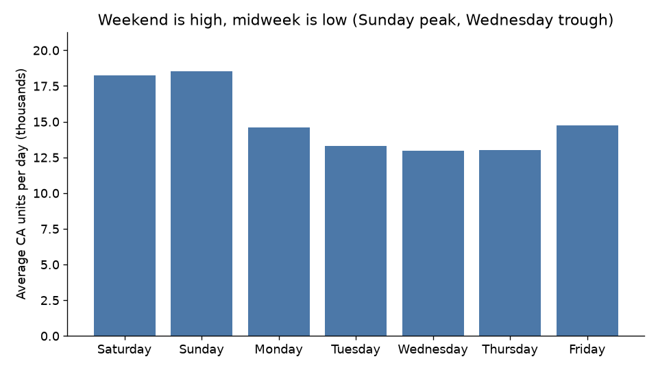
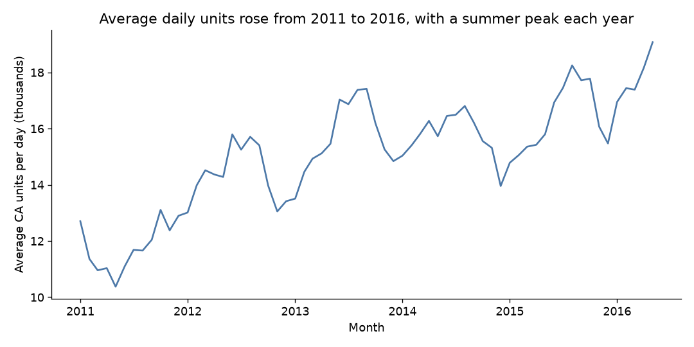
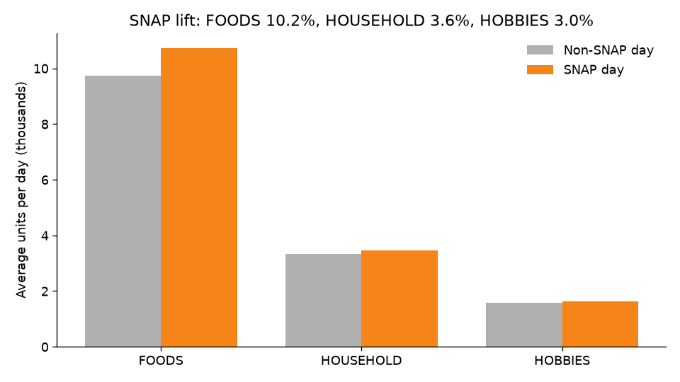
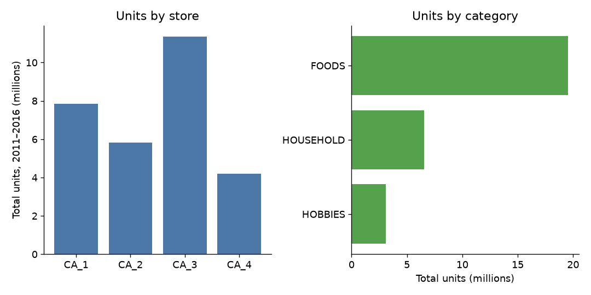

# Analyze — California demand (Walmart M5)

PACE stage: **Analyze**. This page describes the California slice of the M5 files. It does not fit LightGBM, Prophet, or the lag-28 baseline, and it does not report a forecast score. Those belong to Construct.

The checks below are what [the plan](01-plan.md) said Analyze would confirm, plus the grain recommendation for Construct. Every figure comes from `src/analyze_ca.py` run on the local raw files (not re-downloaded). Summary tables are in `data/processed/`. Charts are in `images/`. Raw CSVs stay git-ignored.

## What was checked

Filter `sales_train_evaluation` to `CA_1`, `CA_2`, `CA_3`, and `CA_4`. Join each `d_` column to `calendar.csv` for the date, weekday, Walmart week, and `snap_CA`. Compare the overlap with `sales_train_validation`. Measure zeros, weekday shape, the monthly level, SNAP, store and category volume, and whether `sell_prices` covers those item-store-weeks. No model.

## 1. Shape

| Check | Result |
|---|---|
| Item–store series | **12,196** |
| Distinct items | **3,049**, and the same 3,049 in each of the four stores |
| Other California stores | None. `state_id` is only `CA`. |
| Day columns | `d_1` through `d_1941` (**1,941** days) |
| `d_1` | **2011-01-29**, Saturday, Walmart week 11101 |
| `d_1941` | **2016-05-22**, Sunday, Walmart week 11617 |
| Missing day cells | **0** of 23,672,436 |
| Zero-sale cells | **15,621,951** of 23,672,436 (**0.6599215644727058**) |
| Series that never sell | **0** |
| Cells before the series' first sale | **5,149,759** (0.32964890236821254 of all zero cells) |
| Total CA units | **29,196,717** (average **15,042.100463678516** units per day) |
| Validation vs evaluation on `d_1`–`d_1913` | **0** mismatched cells across all 12,196 series |

The plan's expected size was 3,049 × 4 = 12,196. That is the filter. The validation file is the same history with the last 28 days removed: on the overlapping days the two files agree exactly, once rows are matched on `item_id` + `store_id` (the `id` suffix is `_evaluation` in one file and `_validation` in the other).

A zero is not one thing. Some zeros are days before the item is listed (the next section of the price check: those weeks have **0** units). Some are days after listing when the item did not sell. Some are Christmas, which is a near-shutdown rather than a demand observation (below). The file does not say which remaining zeros were stockouts. This stage does not call every zero a demand zero.

No date has a zero total across all four stores together. Christmas is the closest case, and it is not clean:

| Date | Weekday | CA_1 | CA_2 | CA_3 | CA_4 | State total |
|---|---|---:|---:|---:|---:|---:|
| 2011-12-25 | Sunday | 0 | 7 | 1 | 0 | 8 |
| 2012-12-25 | Tuesday | 0 | 2 | 4 | 0 | 6 |
| 2013-12-25 | Wednesday | 0 | 2 | 3 | 0 | 5 |
| 2014-12-25 | Thursday | 0 | 6 | 0 | 0 | 6 |
| 2015-12-25 | Friday | 0 | 2 | 4 | 0 | 6 |

`CA_1` and `CA_4` are 0 on all five Christmas days. `CA_2` never has a store-total of 0. `CA_3` is 0 only on 2014-12-25. Those five days are not why the zero share is 0.6599215644727058. They are a reason not to read December 25 as ordinary demand.

## 2. Weekly seasonality

Average of the **statewide daily total**, by weekday. Walmart's week starts Saturday (`wday` 1). There are 278 Saturdays and Sundays and 277 of each other weekday in this span.

| Weekday | Days | Total units | Average units per day |
|---|---:|---:|---:|
| Saturday | 278 | 5,068,641 | 18,232.521582733814 |
| Sunday | 278 | 5,145,010 | 18,507.230215827338 |
| Monday | 277 | 4,040,743 | 14,587.519855595669 |
| Tuesday | 277 | 3,680,138 | 13,285.696750902527 |
| Wednesday | 277 | 3,586,412 | 12,947.335740072202 |
| Thursday | 277 | 3,598,892 | 12,992.38989169675 |
| Friday | 277 | 4,076,881 | 14,717.981949458484 |

Sunday is the peak and Wednesday is the trough. Sunday's average is **1.4294238279885783** times Wednesday's. Against the all-days average of 15,042.100463678516, Sunday sits at 1.2303620934134774 and Wednesday at 0.8607398794693302. Saturday is with Sunday, not with the middle of the week. Friday and Monday are the shoulders.

The same shape shows up as a correlation of the statewide daily total with itself: **0.8408696097678586** at a lag of 7 days, and **0.84399231729513** at a lag of 28 days. Lag 28 is four weeks, so it lands on the same weekday. On the state total it does not lose the weekly pattern relative to lag 7. That is the descriptive fact behind the baseline. It is not a fitted model, and it is the aggregate series, not each item.

## 3. Trend

All four stores record positive units on 2011-01-29 and on 2016-05-22. There is no store opening inside the file that would look like a level break. The level still changes. Average units per day, by year (2011 starts on January 29, so it has 337 days; 2016 ends on May 22, so it has 143 days):

| Year | Days | Total units | Average units per day | Change in average vs prior year |
|---|---:|---:|---:|---:|
| 2011 | 337 | 3,943,802 | 11,702.676557863502 | — |
| 2012 | 366 | 5,268,487 | 14,394.773224043716 | +0.230041106653613 |
| 2013 | 365 | 5,733,801 | 15,709.043835616438 | +0.09130193238317119 |
| 2014 | 365 | 5,748,876 | 15,750.345205479452 | +0.0026291460062879413 |
| 2015 | 365 | 5,967,138 | 16,348.323287671234 | +0.03796603022921352 |
| 2016 (through May 22) | 143 | 2,534,613 | 17,724.566433566433 | +0.08418252573541074 vs full-year 2015 |

The early climb is the obvious shift: 2011 to 2013. 2013 to 2014 is almost flat. The fairer read of 2016 is January–April against January–April of 2015, so May is not compared to a full May. Those months are 2,114,986 units over 121 days in 2016 (average 17,479.22314049587) versus 1,818,718 units over 120 days in 2015 (average 15,155.983333333334), which is a change of **+0.1532886224579646**. The holdout sits on that higher level.

Inside each year the month pattern repeats: summer is higher, winter is lower. In 2015, August averages 18,247.483870967742 units per day and January averages 14,783.387096774193 (August / January − 1 = 0.23432361958170134). December is the weak month, and Christmas sits inside it. January 2011 has only 3 days in the file; that short month is not a demand crash.

What this means for a forecast, without fitting one: a method that copies 2011 will sit too low. Lag-28 does not do that. For the holdout it copies 2016-03-28 through 2016-04-24, which is already on the 2016 level. A model that only learns a single global mean will smear the summer peak into the spring holdout.

## 4. SNAP

`snap_CA` is on for the **1st through the 10th of every month** that exists in this date range, and off otherwise. That is 64 months × 10 days = **640** SNAP days, and **1,301** non-SNAP days. January 2011 does not include days 1–10 because the file starts on January 29, so those days are absent rather than non-SNAP.

Average statewide units per day:

| | Days | Average daily units | Total units |
|---|---:|---:|---:|
| SNAP | 640 | 15,823.4234375 | 10,126,991 |
| Non-SNAP | 1,301 | 14,657.74481168332 | 19,069,726 |

The SNAP average is higher by lift **0.07952646473197889** (15,823.4234375 / 14,657.74481168332 − 1). The lift is not shared evenly:

| Category | SNAP average daily units | Non-SNAP average | Lift |
|---|---:|---:|---:|
| FOODS | 10,733.3828125 | 9,735.970791698694 | **0.1024460777606011** |
| HOUSEHOLD | 3,463.5203125 | 3,342.5165257494236 | 0.03620140269117922 |
| HOBBIES | 1,626.5203125 | 1,579.2574942352037 | 0.02992724013488668 |

Food moves. Household and hobbies move a little. A California model that drops `snap_CA`, or that uses `snap_TX` / `snap_WI` instead, will put that food miss on the first ten days of the month. The holdout contains 10 SNAP days in a row: **2016-05-01 through 2016-05-10**.

## 5. Intermittency, and why that hurts MAPE

"Sells on a day" means units greater than zero. A series is intermittent here if that happens on fewer than half of days.

| Slice | Series | Fewer than half of all 1,941 days | Share | Fewer than half of days after the first sale | Share | Median share of days with a sale, after first sale |
|---|---:|---:|---:|---:|---:|---:|
| All CA | 12,196 | 9,145 | 0.7498360118071499 | 7,679 | 0.6296326664480157 | 0.40610295109545236 |
| FOODS | 5,748 | 3,826 | 0.6656228253305497 | 2,951 | 0.5133959638135004 | 0.4916002360078755 |
| HOUSEHOLD | 4,188 | 3,374 | 0.8056351480420249 | 2,918 | 0.6967526265520535 | 0.3460161398387375 |
| HOBBIES | 2,260 | 1,945 | 0.8606194690265486 | 1,810 | 0.8008849557522124 | 0.250778842449923 |

Listing timing is not the whole story. After each series' own first sale, 7,679 of 12,196 series (share 0.6296326664480157) still sell on fewer than half of the remaining days. The median series is positive on 0.29314786192684184 of all days and on 0.40610295109545236 of days after it starts. Hobbies are the thin end: the median hobby series is positive on about a quarter of days after its first sale. Foods are closer to a coin flip, not to a series that sells every day.

Zero share of cells by category: FOODS **0.6010612476548077**, HOUSEHOLD **0.6924089926961899**, HOBBIES **0.7494223395476285**.

MAPE divides the absolute miss by the actual. On a zero-actual day that ratio is undefined. Those days are 15,621,951 of 23,672,436 item-store-days, so a MAPE that silently drops them is a score on the minority of days, and a MAPE that does not drop them explodes. When the actual is 1 unit, a miss of 1 unit is a 100% error; when the actual is 2, the same miss is 50%. An intermittent series can post a terrible MAPE even when the unit miss is small, and a series that sells every day can post a modest MAPE on a much larger unit miss. That is why the plan scores MAPE only on positive-actual days, prints the share of days excluded, and puts WAPE (sum of absolute errors over sum of actual units, zeros included) next to it. This stage still does not compute those scores. It is the reason they were specified that way.

## 6. Store differences

Each store has the same 3,049 items. Volume does not match.

| Store | Total units | Share of CA units | Zero-cell share |
|---|---:|---:|---:|
| CA_3 | 11,363,540 | 0.3892060877940489 | 0.5939976772986101 |
| CA_1 | 7,832,248 | 0.26825783186513746 | 0.6375904870964695 |
| CA_2 | 5,818,395 | 0.19928250837243106 | 0.6881029058437417 |
| CA_4 | 4,182,534 | 0.14325357196838262 | 0.7199951876520017 |

`CA_3` sold 11,363,540 / 4,182,534 = 2.717137667848483 times as many units as `CA_4`. The smaller store is also the more intermittent one (zero-cell share 0.7199951876520017). A single model can be fit across stores, but a score that is not broken out by store will mostly describe `CA_3`.

## 7. Category mix

The item id starts with the category, and `cat_id` is on the row. Three categories, nothing else.

| Category | Series | Total units | Share of CA units | Zero-cell share |
|---|---:|---:|---:|---:|
| FOODS | 5,748 | 19,535,863 | 0.6691116333387758 | 0.6010612476548077 |
| HOUSEHOLD | 4,188 | 6,565,267 | 0.22486319266649055 | 0.6924089926961899 |
| HOBBIES | 2,260 | 3,095,587 | 0.10602517399473373 | 0.7494223395476285 |

Food is two-thirds of the units. Inside food, department `FOODS_3` alone is **14,106,481** units, which is **0.48315298600181655** of all California units (3,292 series). `HOBBIES_2` is the small end: 218,242 units, share 0.007474881508081885 of the state, zero-cell share 0.8827517470064901.

## 8. Price coverage

`sell_prices` is one row per `item_id`, `store_id`, and `wm_yr_wk`. It is not a daily price. California only:

| Check | Result |
|---|---|
| CA price rows | **2,708,822** |
| Stores present | **4** (CA_1 through CA_4) |
| Duplicate item–store–week keys | **0** |
| Null prices | **0** |
| Price weeks | **11101 through 11621** |
| Sales weeks (`d_1`–`d_1941`) | **11101 through 11617** (278 weeks) |
| Series with no price row at all | **0** |
| Series whose first price week is after 11101 | **7,681** of 12,196 |
| Series with a price on the last sales week (11617) | **12,196** of 12,196 |
| Item–store–weeks in the sales span | **3,390,488** (12,196 × 278) |
| Of those, with a price | **2,660,038** (coverage **0.7845590369291973**) |
| Before the series' first price | **730,450** |
| Interior holes (missing week between first and last price) | **0** |
| Weeks after the last price but still inside the sales span | **0** |
| Price rows on weeks outside the sales span | **48,784** = 12,196 × 4 |
| Units sold on days before the first price week | **0** |

The uncovered share, 730,450 / 3,390,488 = 0.2154409630708028, is entirely "not listed yet." Once a price appears, every later sales week has a price. There is nothing to interpolate inside an active item's history. Days before the first price contribute **0** units, so the gap lines up with the leading zeros rather than with hidden sales. The 48,784 extra rows are the four Walmart weeks after `d_1941` (11618–11621), one row per CA series. That is the unpublished horizon's prices sitting in the file. They are not used here.

Construct may use price as a feature on weeks the row exists. It should not fill a pre-listing week with a later price and then treat that week as if the item had been on the shelf. Those weeks have no sales.

## Holdout calendar

The last 28 day columns are the test window the plan named. Confirmed from the calendar, not assumed:

- `d_1914` to `d_1941`: **2016-04-25 (Monday) through 2016-05-22 (Sunday)**.
- Events inside the window: Pesach End (2016-04-30), Orthodox Easter (2016-05-01), Cinco de Mayo (2016-05-05), Mother's Day (2016-05-08).
- SNAP: 2016-05-01 through 2016-05-10 (10 days).
- Walmart weeks: **11613** has 5 days (Monday–Friday, partial), **11614–11616** have 7 days each, **11617** has 2 days (Saturday–Sunday, partial).

A weekly executive table that sums 11613 or 11617 and calls it a week will understate volume. The daily score uses all 28 days either way. Mark the partial weeks; do not drop the days.

## Worked lag-28 example (definition only)

The baseline the plan specified, for one fast series so the copy is not a string of zeros: `FOODS_3_090` at `CA_3`, the highest-unit item inside the Excel pair below.

The holdout day `d_1914` (2016-04-25, Monday) sold **133** units. The lag-28 forecast is the actual on `d_1886` (2016-03-28, also a Monday): **61** units. The source day is inside training (`d_1913` is the last training day). The same shift covers the other 27 holdout days; the pairs are in `data/processed/ca_lag28_example.csv`. This is the definition a reviewer can see. It is not a score, and one item's 133-versus-61 day is not evidence the baseline fails. Scoring it is Construct.

## Recommendation for Construct

Prove the pipeline on **FOODS at CA_3** before fitting all 12,196 series. Food is 19,535,863 of 29,196,717 CA units (share 0.6691116333387758), and CA_3 is the largest store, so that pair is 1,437 item–store series and **7,625,660** units (share 0.2611821048236348 of the state) with only **one** day on which the category–store total is zero — 2014-12-25. That is the Excel workbook pair: one category, one store, a daily total that actually shows the weekly shape. `FOODS_3` (14,106,481 units, share 0.48315298600181655 of CA) is the smaller cut if even 1,437 series is too heavy for a first debug pass. Do not start on HOBBIES: 1,945 of 2,260 of those series (share 0.8606194690265486) sell on fewer than half of days, so a bug in the zero handling will be invisible. The decision grain stays item–store–day for all four stores, rolled up bottom-up; the first grain to *build* is FOODS, not a separate weekly model. Lag-28 is the right naive baseline: Sunday averages 18,507.230215827338 units against Wednesday's 12,947.335740072202, and the state total correlates 0.84399231729513 with itself 28 days later, against 0.8408696097678586 at lag 7, so the four-week copy keeps the weekday the plan relied on. Keep `snap_CA` on the feature list for food, do not score partial Walmart weeks as full weeks, and leave pre-listing price weeks empty.

Construct and Execute are not done in this file.
