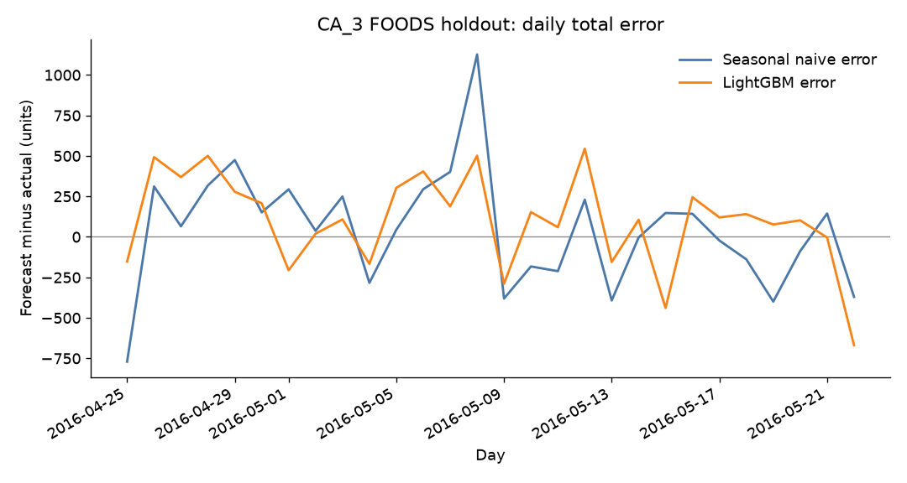

# Construct — FOODS at CA_3, 28-day forecast

PACE stage: **Construct**. This page fits the seasonal-naive baseline and one LightGBM model, then scores them on the holdout. It is not the executive report and it is not a Tableau dashboard. Those belong to Execute.

Every figure below is from one run of `src/construct_forecast.py` on the local raw files. The metrics file is `data/processed/ca3_foods_metrics.csv`. The row-level forecasts are `data/processed/ca3_foods_holdout_predictions.csv`. Raw CSVs stay git-ignored.

## What was built

Scope is the cut Analyze recommended and the plan's rules still apply:

- **Series:** FOODS at store CA_3 only. **1,437** items, one series each. The script stops if that count is not 1,437.
- **Target:** daily unit sales.
- **Holdout:** `d_1914` through `d_1941`, **2016-04-25 (Monday) through 2016-05-22 (Sunday)**. 28 days. Confirmed from `calendar.csv` inside the script, not assumed.
- **Training labels:** `d_1` through `d_1913` only. The first target day that has every sales feature filled is `d_56` (a 28-day rolling window ending at lag 28 reaches back 55 days).
- **Baseline:** seasonal naive, lag-28. The forecast for each holdout day is that item's actual from 28 days earlier (same weekday, four weeks back). For this horizon those source days are `d_1886` through `d_1913`, the 28 days immediately before the holdout. No holdout actual is used.
- **Stronger model:** LightGBM, direct multi-step, one pooled model for all 1,437 items. Fit with `lightgbm.train` (native API, LightGBM 4.7.0). Not a separate model per item, and not a recursive forecast.

Outputs:

| File | What it is |
|---|---|
| `src/construct_forecast.py` | The fit, the scores, the chart, the one-item workbook |
| `data/processed/ca3_foods_holdout_predictions.csv` | 40,236 rows: `item_id`, `day`, `actual`, `baseline`, `lgbm` |
| `data/processed/ca3_foods_metrics.csv` | MAPE, WAPE, bias overall and by weekday |
| `images/ca3_foods_forecast_vs_actual.png` | Daily total actual vs both forecasts |
| `images/ca3_foods_daily_error.png` | Daily total (forecast − actual) for both models |
| `reports/ca3_foods_one_item_forecast.xlsx` | Highest-volume item, baseline vs LightGBM |

40,236 = 1,437 × 28.

## Why these features

Sales features are only lags of 28 or more. At a 28-day horizon, yesterday's units are not known yet, so they are not in the model.

| Feature | What it is | Why it is here |
|---|---|---|
| `lag_28` | Units on the same weekday four weeks before the target day | The seasonal-naive forecast itself, and the most recent same-weekday actual that is always already observed 28 days ahead |
| `lag_35` | Same weekday five weeks back | A second week so one odd week is not the whole story |
| `lag_42` | Same weekday six weeks back | A third point on the weekly cycle, still outside the horizon |
| `roll_mean_7_ending_lag28` | Mean of the 7 days ending on the lag-28 day | The latest fully known week, next to the single lag-28 point |
| `roll_mean_28_ending_lag28` | Mean of the 28 days ending on the lag-28 day | A month of level, shifted with the target day |
| `wday` | Walmart weekday of the target day (1 = Saturday … 7 = Friday), categorical | Known from the calendar before the day arrives. Analyze: Sunday is the peak and Wednesday is the trough |
| `month` | Month of the target day, categorical | Known ahead. Carries the within-year level without using a future sales total |
| `snap_CA` | 1 on California SNAP days (the 1st–10th) | Known ahead. Analyze: food moves more than household or hobbies on these days. The holdout includes 2016-05-01 through 2016-05-10 |
| `event_flag` | 1 if `event_name_1` or `event_name_2` is filled | Known ahead. One flag, not one column per holiday |
| `sell_price` | Price of this item at CA_3 for the Walmart week that contains the target day | From `sell_prices` when that week has a row. A price can change demand. It is not a sales lag |

`wday` and `month` are categorical so the tree does not treat Saturday (1) as "less than" Friday (7).

No `item_id` column. The level of each series enters through its own lags. On the refit model, gain ranked in this order: `roll_mean_28_ending_lag28`, `roll_mean_7_ending_lag28`, `lag_28`, `sell_price`, `month`, `lag_42`, `lag_35`, `wday`, `snap_CA`, `event_flag`. The event flag was barely used. That ranking is from this fit, not a claim that events never matter.

Price on the holdout was complete: share of missing holdout prices was 0.0. Weeks before an item is listed stay missing in training. They are not filled with a later price.

## Leakage rule

A sales feature for target day `t` may use units on day `t − k` only when `k ≥ 28`. Both rolling means **end** on the lag-28 day, so they do not include lags 1–27. Those short lags would sit inside the horizon for a forecast made 28 days ahead.

Direct multi-step, not recursive: the same columns are filled for all 28 holdout days from history that ends on `d_1913`. The newest sales day any holdout feature reads is the lag-28 day of `d_1941`, which is `d_1913`. The script raises if that check fails. The holdout `lag_28` column is also checked against the sales matrix shifted by 28.

Calendar fields are the target day's own calendar. The price is the target week's price. Neither is computed from sales inside the horizon.

Holdout actuals are not training labels. The tree count is chosen on an earlier slice that is also before the holdout: `d_1886` through `d_1913` (2,629,710 train rows before that slice, 40,236 rows in the slice). Early stopping watches L2 on that slice, patience 40 rounds, cap 400 trees. The log's best iteration was **82**, with reported validation L2 **12.2367**. The model that is scored is a refit of **82** trees on every feature-complete day from `d_56` through `d_1913`, including that early-stopping slice. The holdout is not in either fit.

Other settings, fixed before looking at the holdout score: objective regression (L2), learning rate 0.05, 63 leaves, `min_child_samples` 100, bagging fraction 0.8 every tree, feature fraction 1, seed 42. Predictions below 0 are clipped to 0. This run clipped **0** of 40,236 holdout predictions.

Lags 1–27 are not built recursively and are not used.

## Metrics

Definitions, applied to item-days (not to the daily total, and not averaged per item first):

- **MAPE** = mean of `|forecast − actual| / actual` on item-days with **actual > 0**. A zero actual makes that ratio undefined, so those days are out of MAPE only.
- **WAPE** = sum of `|forecast − actual|` / sum of actual. Zeros stay in. This is the volume-weighted score. A high-unit miss moves it more than a one-unit miss.
- **bias** = sum of `(forecast − actual)` / sum of actual. Positive means the forecast is high in total units. Negative means it is low.

The ratios are not multiplied by 100. WAPE of 0.6490765893903951 means the absolute miss is that share of actual units.

Holdout actual units: **109,870**. Item-days: **40,236**. Of those, **25,302** have actual > 0 and enter MAPE. The other **14,934** are zeros and are excluded from MAPE only. Each weekday occurs 4 times in a 28-day window, so each weekday row is 1,437 × 4 = **5,748** item-days.

### Overall

| Model | MAPE (actual > 0) | WAPE | bias | Sum of absolute error | Sum of (forecast − actual) |
|---|---:|---:|---:|---:|---:|
| Seasonal naive (lag-28) | 0.8781250159967809 | 0.777000091016656 | 0.010694457085646673 | 85369.0 | 1175.0 |
| LightGBM | 0.5633893484087068 | 0.6490765893903951 | 0.02570857287913414 | 71314.04487632272 | 2824.600902230468 |

**LightGBM beat the baseline on WAPE and on MAPE.** WAPE is the volume-weighted comparison the plan asked for. Absolute error fell from 85,369 units to 71,314.04487632272 units.

**LightGBM did not win on bias.** Both forecasts are high in total. The baseline is high by 1,175 units (bias 0.010694457085646673). LightGBM is high by 2,824.600902230468 units (bias 0.02570857287913414). A lower absolute error with a higher total is still an over-forecast, not a reason to treat the model as unbiased.

MAPE is much larger than WAPE for both models because it is an unweighted mean over item-days, and many of those days are small counts. A miss of 1 unit on a day that sold 1 unit is a 100% MAPE error. Do not lead a manager with MAPE.

### By weekday

Seasonal naive:

| Weekday | MAPE | WAPE | bias | Sum of actual |
|---|---:|---:|---:|---:|
| Saturday | 0.9038168575803124 | 0.7404011461318052 | 0.03965616045845272 | 17450.0 |
| Sunday | 0.8947266209591159 | 0.7615560403033136 | 0.062065025449257294 | 19254.0 |
| Monday | 0.8357941037396879 | 0.7619767723203484 | -0.058855552867166705 | 16532.0 |
| Tuesday | 0.8948828623649565 | 0.8120019402674797 | 0.0245305245651722 | 14431.0 |
| Wednesday | 0.8619867906459328 | 0.7925210259261833 | -0.03961910057690971 | 14387.0 |
| Thursday | 0.8548711126061935 | 0.8066721767225186 | 0.01427605379818168 | 13309.0 |
| Friday | 0.8972921328169511 | 0.7812090714827324 | 0.01978355276762942 | 14507.0 |

LightGBM:

| Weekday | MAPE | WAPE | bias | Sum of actual |
|---|---:|---:|---:|---:|
| Saturday | 0.5822511863899636 | 0.6123337887666629 | 0.028438249412784875 | 17450.0 |
| Sunday | 0.556940026195429 | 0.6045699016113305 | -0.04232832418464977 | 19254.0 |
| Monday | 0.5340876252178307 | 0.6301648779761346 | -0.010851997940360798 | 16532.0 |
| Tuesday | 0.5617469947963659 | 0.6613556460970794 | 0.0604199005560734 | 14431.0 |
| Wednesday | 0.5595251243429415 | 0.6776249150704433 | 0.02783930193481845 | 14387.0 |
| Thursday | 0.5717487870844438 | 0.7102066377808693 | 0.10688316420335713 | 13309.0 |
| Friday | 0.5783375936476854 | 0.6772863093573736 | 0.04327542424589884 | 14507.0 |

LightGBM's WAPE is lower on every weekday. Its bias is not. Thursday is the high side (bias 0.10688316420335713). Sunday is the low side (bias -0.04232832418464977), while the baseline's Sunday bias is positive (0.062065025449257294). Sunday is also the highest-unit weekday in this window (19,254 actual units).

## One item in Excel

`reports/ca3_foods_one_item_forecast.xlsx` is **FOODS_3_090**, department **FOODS_3**, store **CA_3**. It was chosen as the FOODS item at CA_3 with the highest sum of units on `d_1` through `d_1913`: **250,502** training units. Holdout units were not used to pick it. The holdout then sold **3,357** units, and all 28 days were positive.

The workbook has the 28 holdout days (actual, lag-28, LightGBM), a line chart, the 28 source days the baseline copies (`2016-03-28` through `2016-04-24`), and this item's scores. The first holdout day matches the worked example in Analyze: **2016-04-25** actual **133**, lag-28 baseline **61** (the actual on 2016-03-28). LightGBM on that day is **81.73313553207025**.

Scores on this item only, from the Item metrics sheet:

| Model | MAPE | WAPE | bias | Sum of absolute error | Sum of (forecast − actual) |
|---|---:|---:|---:|---:|---:|
| Seasonal naive | 0.2028302705195178 | 0.1974977658623771 | -0.07953529937444147 | 663 | -267 |
| LightGBM | 0.1945756276869436 | 0.2129970073026922 | -0.1505686355631554 | 715.0309535151379 | -505.4589095855129 |

**On this item, LightGBM loses on WAPE.** The baseline's absolute error is 663 units; LightGBM's is 715.0309535151379. LightGBM's MAPE is slightly lower. Both forecasts are low here, and LightGBM is lower (bias -0.1505686355631554 versus -0.07953529937444147). The aggregate win is not a win on the busiest series. The pooled model is pulled by the other 1,436 items.

## What the charts show

The lines are sums across all 1,437 items, not one item. Both forecasts keep the weekend peak. The baseline's largest daily miss in this window is Sunday **2016-05-08**: actual **4,327**, baseline **5,453** (error **+1,126**), LightGBM **4,827.5309141213** (error **+500.5309141213**). LightGBM's largest shortfall is the last day, Sunday **2016-05-22**: actual **5,069**, LightGBM **4,399.3233688866** (error **-669.6766311134**), baseline **4,698** (error **-371**).

The error chart is daily total forecast minus daily total actual. Above zero means that day's forecast was high. It is the same 28 days, not a new model.

## What Execute should say to a manager

Say this, and no more than this:

On food at CA_3, for the 28 days ending 2016-05-22, a LightGBM model beat a same-weekday-four-weeks-ago copy on volume-weighted absolute error. WAPE was 0.6490765893903951 versus 0.777000091016656. The absolute miss was 71,314.04487632272 units versus 85,369 units, on 109,870 units actually sold. Both forecasts came out high in total: the copy by 1,175 units, LightGBM by 2,824.600902230468 units. Lower absolute error is not the same thing as an unbiased forecast.

MAPE on days that sold at least one unit was 0.5633893484087068 for LightGBM and 0.8781250159967809 for the copy. That number looks worse than WAPE because small item-days count the same as large ones, and 14,934 of 40,236 item-days sold nothing and are not in MAPE.

The busiest item, FOODS_3_090, is the exception already measured: on that series the four-week copy had the lower WAPE (0.1974977658623771 versus 0.2129970073026922). Do not tell a buyer that the model is better on every item.

This is one category, one store, and one 28-day origin. It is not a score for the other California stores, and not for household or hobbies. Do not attach a dollar saving, a service-level change, or a safety-stock cut to these ratios. Whether the remaining unit error is small enough to change a replenishment buffer is a later decision (inventory is project 02), and it is not answered here.

Execute can show the daily chart and the metrics table. It should not refit the model or widen the scope in the executive page.

## What this file does not claim

- No dollar impact. None was calculated.
- No statement that LightGBM is unbiased. The bias is positive overall.
- No statement that LightGBM wins on the highest-volume item. It does not, on WAPE.
- No statement about CA_1, CA_2, CA_4, HOUSEHOLD, or HOBBIES. Those series were not fit.
- The early-stopping slice (`d_1886`–`d_1913`) is inside the refit, so the tree count was chosen on days the final model also trains on. The holdout was not used to choose it. That is a limit on how clean the tree count is, not a leak of holdout actuals.
