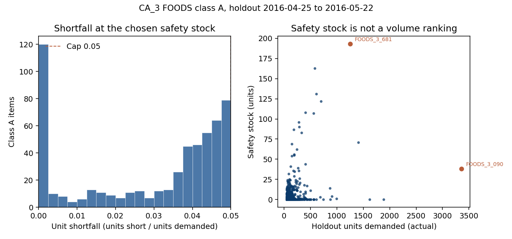

# Inventory Optimization — Reorder Point and Safety Stock (Walmart M5, CA_3 Food)

## Start here

Read the files in this order. The short versions come first for the big picture, then the details.

1. This README, for the question, the result, and the limits.
2. [reports/executive-summary.md](reports/executive-summary.md), for the decision and the key numbers.
3. [dashboards/class_a_policy_dashboard.html](dashboards/class_a_policy_dashboard.html), the one-page dashboard. Download it and open it in a browser.
4. [data/README.md](data/README.md), for the one input file (the Project 1 forecast) and what it doesn't contain.
5. [reports/01-plan.md](reports/01-plan.md), for the rules set before any numbers: class A, the 5% unit cap, the 7-day lead time, and why the work stays in units.
6. [reports/02-analyze.md](reports/02-analyze.md), with [ABC cumulative share](images/abc_cumulative_share.png) and [daily forecast error](images/daily_forecast_error_hist.png) open.
7. [reports/03-construct.md](reports/03-construct.md), with [class A safety stock](images/class_a_safety_stock.png) open.
8. [data/processed/policy.csv](data/processed/policy.csv), to look up any item's reorder point and safety stock.
9. [reports/03-construct-solver.xlsx](reports/03-construct-solver.xlsx), one item (FOODS_3_090) traced in Excel.
10. [reports/04-execute.md](reports/04-execute.md) and [reports/business-report.md](reports/business-report.md), for the final recommendation and the manager version.
11. [src/analyze_inventory.py](src/analyze_inventory.py), then [src/construct_policy.py](src/construct_policy.py), if you want to see the code.

## Executive summary

**Business question.** For the top food items at Walmart store CA_3, what reorder point and safety stock keep unfilled demand under 5% while holding as few units as possible? This builds on the Project 1 LightGBM forecast.

**Result.** Class A is 558 of 1,437 food items, 80.3% of the 109,870 units sold from 2016-04-25 through 2016-05-22. Replaying those 28 days of real sales, the policy leaves 2,682 of 88,230 class A units unfilled, a 3.0% unfilled share (97.0% unit fill rate). Every item stays under the 5% cap; the tightest, FOODS_2_266, is at 4.99%. Average on-hand is about 14,461 units, of which 4,079 are safety stock. 193 items need no safety stock at all.

**Recommendation.** Set each class A item's reorder point and safety stock from [policy.csv](data/processed/policy.csv), order one week of that item's forecast each time, and use the forecast as published. Track the unfilled share of units, not cycle service.

**Not in this result.** Class B and C items, other stores, dollar costs or savings, and real lead times.

## Reports, charts, and code

| | |
|---|---|
| Plan | [reports/01-plan.md](reports/01-plan.md) |
| Analyze | [reports/02-analyze.md](reports/02-analyze.md) |
| Construct | [reports/03-construct.md](reports/03-construct.md), [reports/03-construct-solver.xlsx](reports/03-construct-solver.xlsx) |
| Execute | [reports/04-execute.md](reports/04-execute.md) |
| Executive summary | [reports/executive-summary.md](reports/executive-summary.md) |
| Business report | [reports/business-report.md](reports/business-report.md) |
| Charts | [abc_cumulative_share.png](images/abc_cumulative_share.png), [daily_forecast_error_hist.png](images/daily_forecast_error_hist.png), [class_a_safety_stock.png](images/class_a_safety_stock.png) |
| Dashboard | [dashboards/class_a_policy_dashboard.html](dashboards/class_a_policy_dashboard.html) (open the file; GitHub will show the source) and [dashboards/TABLEAU.md](dashboards/TABLEAU.md) |
| Code | [src/analyze_inventory.py](src/analyze_inventory.py), [src/construct_policy.py](src/construct_policy.py) |

The dashboard is a static HTML page. Publishing to Tableau Public is a manual step: import `dashboards/class_a_policy.csv`. In that file, `fill_rate` is the unfilled share, not the filled share. Nothing has been published to Tableau Public yet.

## Data
See [`data/README.md`](data/README.md). The only input is the committed Project 1 forecast file. No raw data is downloaded.

## Approach (PACE: Plan, Analyze, Construct, Execute)
- **Plan:** [reports/01-plan.md](reports/01-plan.md). Decisions made before any results:
  - **Which items:** ABC on actual holdout units. Class A is the items that add up to 80% of units, including the whole tie at the cutoff.
  - **The cap:** unit fill rate. Units short divided by units demanded must be under 5% for every class A item. Cycle service and stockout days are reported but not used as the target.
  - **Lead time:** a fixed 7 days. The data has no lead time, so this is a labeled assumption.
  - **Units, not dollars:** the data has no unit cost, holding rate, or order cost. Shelf price is not supplier cost, so no dollar figures are claimed.
  - **Order quantity:** one week of that item's average daily forecast, rounded up to a whole unit. It is not an EOQ.
  - **Forecast:** LightGBM as published, not corrected on the same 28 days used to score the policy.
  - **Replay rules:** check on-hand plus on-order every day, unmet demand is a lost sale, and safety stock is the only thing the search can change.
- **Analyze:** [reports/02-analyze.md](reports/02-analyze.md). Overall the forecast runs 2.6% high, but on class A it runs 5.7% low (5,021 units). The overall average hides that, because class C is over-forecast by more than it sold. Daily misses on class A average 2.9 units and range from about 82 under to about 60 over.
- **Construct:** [reports/03-construct.md](reports/03-construct.md). For each item, safety stock starts at zero and goes up one unit at a time. Each step replays the 28 days, and the smallest amount that keeps that item under 5% unfilled is kept. Reorder point is one week of forecast plus that safety stock. The replay starts on April 25 with on-hand at the reorder point, because the data has no inventory history.
- **Execute:** [reports/04-execute.md](reports/04-execute.md), [reports/executive-summary.md](reports/executive-summary.md), [reports/business-report.md](reports/business-report.md), and the dashboard.

## Key Findings
- **Fill target met with room to spare.** 3.0% of class A units went unfilled against a 5% cap, and no single item went over.
- **Safety stock follows forecast error, not sales volume.** The best seller, FOODS_3_090, needs 38 units. The second-best seller, FOODS_3_586, needs none. FOODS_3_681, fifth by volume, needs 193, the most in the class, because its forecast said 919 units and it sold 1,253.
- **The textbook formula would have failed.** Daily error spread times the square root of 7 gives 3,012 units of safety stock, but 186 items still go over 5%, while 314 others get more than they need. Testing each item directly takes 4,079 units and passes every item.
- **Fill rate and cycle service tell different stories.** About 21% of order cycles had at least one stockout, so cycle service is about 79%, not 95%. Most of those were small misses, which is why the unit fill rate is still 97%.

## Recommendation
Set the reorder point and safety stock for each of the 558 class A items from [policy.csv](data/processed/policy.csv). Order one week of that item's forecast each time. Don't correct the forecast upward on the same period used to test the policy, and judge the shelf by the share of units unfilled, not by cycle service. Before using this in a real store, replace the 7-day lead time with actual supplier lead times and rerun the search.

## Impact
Every class A item meets the 5% unfilled-unit cap while holding about 14,461 units on average, 4,079 of them safety stock. No dollar savings are claimed. The data has no supplier costs, and there are no "before" reorder points to compare against.

## Limitations
- Lead time is an assumed 7 days with no variability.
- The opening stock on April 25 is assumed. A different starting balance would change both the unfilled units and the units held.
- The policy is tested on one 28-day window, and a typical item has only about 4 order cycles in it.
- Excel Solver was not run. The workbook reproduces the Python results for FOODS_3_090, but the search itself was done in Python.

## Tools
Python (pandas, NumPy, Matplotlib), Excel

## How to Reproduce
1. No download is needed. The input is the committed Project 1 file `../01-demand-forecasting/data/processed/ca3_foods_holdout_predictions.csv` (see `data/README.md`).
2. Run `python src/analyze_inventory.py`, then `python src/construct_policy.py`.
3. Outputs go to `data/processed/`, charts to `images/`, dashboard files to `dashboards/`, and write-ups to `reports/`.
