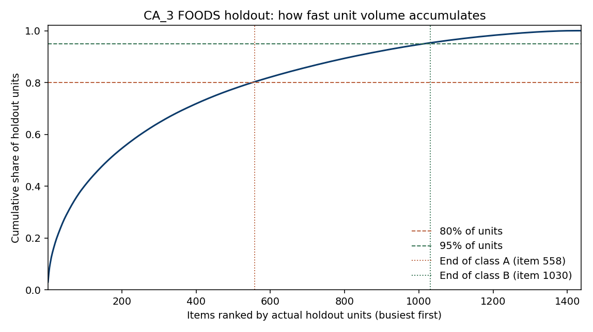
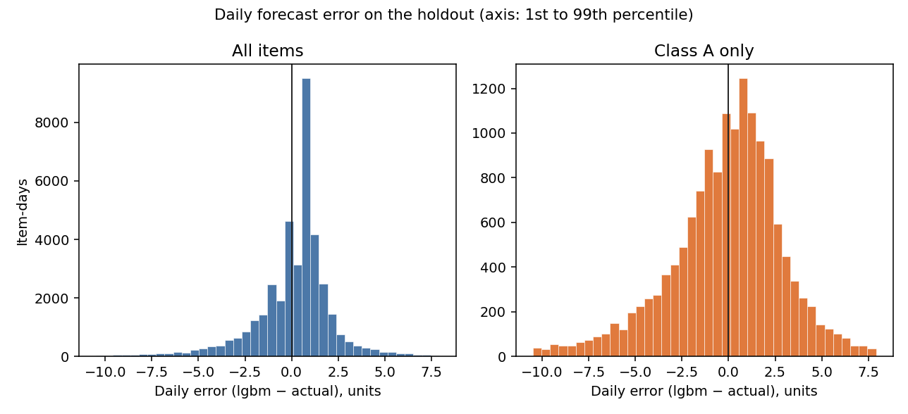

# Analyze — CA_3 FOODS inventory (volume and forecast error)

PACE stage: **Analyze**. This file applies the class rule the plan already decided and measures how far the planning forecast sits from the units that sold. It does not compute a reorder point, a safety stock, an order quantity, an EOQ, a Solver solution, or a simulation. Those are Construct. The ten decisions at the end of [01-plan.md](01-plan.md) are not reopened. The project README is still the template. This file does not fill it.

The path through the page is: what was counted, how the classes were cut, how large the forecast misses are, and what is still missing before anyone sizes a buffer.

## What was counted

The only input is `01-demand-forecasting/data/processed/ca3_foods_holdout_predictions.csv`. I checked it rather than reusing a rounded figure from the plan. The columns are `item_id`, `day`, `actual`, `baseline`, and `lgbm`. There are no missing values. The grid is complete: **1,437** items, **28** days, **40,236** rows. The days run **2016-04-25 through 2016-05-22** with no gaps. Every measure on the file is daily unit sales.

The planning forecast is **`lgbm`**. `actual` is what sold. `baseline` is the seasonal naive from Project 1, kept here only so that comparison can be recomputed on the same rows. `actual` is not treated as the demand a buyer expected on 2016-04-24.

`sell_price` was not opened. The shelf price is what the shopper paid, not what the unit cost the retailer, and there is no holding-cost rate to turn a price into a cost of holding. Ranking items by units times price, or scoring a miss in dollars, would invent that cost. ABC is ranked on actual holdout units. The objective stays in units. Dollar savings will not be claimed.

## How the classes were cut

The plan's rule is cumulative unit volume, not a headcount chosen in advance. Items are ranked by actual holdout units, highest first. **Share** is that item's units divided by all holdout units (**109,870**). **Cumulative share** is the running sum of those shares in rank order. `item_id` ascending is only the order of the file when two items have the same unit count. It is not a rank.

**Class A** is every item with at least as many holdout units as the first item whose cumulative share reaches 80%. That item is included. Stopping one item earlier would leave the class short of 80%. Every other item with that same unit count is included too. Splitting the tie would let `item_id`, not units, decide who is in A. **Class B** is the same rule on what remains: the next volumes until the cumulative share reaches 95%, and the whole tie at that volume. **Class C** is whatever is left. B is the next slice to 95%. C is the rest. Not retail value.

The counts and unit shares are in `data/processed/abc_class_summary.csv`.

| Class | Items | Share of items | Holdout units | Share of units |
|---|---:|---:|---:|---:|
| A | 558 | 0.3883089770354906 | 88,230 | 0.8030399563120051 |
| B | 472 | 0.32846207376478775 | 16,486 | 0.15005005916082642 |
| C | 407 | 0.28322894919972164 | 5,154 | 0.04690998452716847 |
| All | 1,437 | 1 | 109,870 | 1 |

558 + 472 + 407 = 1,437. 88,230 + 16,486 + 5,154 = 109,870.

Class A is not a small set. It is **558** items, a share of items of 0.3883089770354906, to reach a unit share of 0.8030399563120051. That is a long list. The curve in the chart climbs quickly at the left, because the busiest item alone is 0.030554291435332667 of units, and then it keeps climbing through 558 items before class A is complete. A handful of SKUs does not hold this category.

The 80% line is crossed inside a tie, which is why the class does not stop at exactly 80%.

- `FOODS_3_825` is the last item with 50 units. Its cumulative share is 0.7999180850095567. The class is still short of 80% without the next item.
- `FOODS_1_044` is the first item whose cumulative share reaches 80%. It has 49 units and cumulative share 0.8003640666241922.
- Seven items have 49 units. All seven are class A. The last of them is `FOODS_3_819`, cumulative share 0.8030399563120051. That is the class A unit share in the table. Putting the later 49-unit items in B would have drawn the line with `item_id`.

The 95% line is the same kind of cut.

- `FOODS_2_092` is the first item whose cumulative share reaches 95%, at 0.9501592791480841, with 23 units.
- Twenty-one items have 23 units. All twenty-one are class B. The last class B item is `FOODS_3_705`, cumulative share 0.9530900154728316.
- Class C starts at the next lower volume. Sixteen items in `abc_classes.csv` have holdout units of 0. They are in C.



The chart ranks items from busiest to slowest. The horizontal lines are 80% and 95% of units. The vertical lines are the last class A item (item 558) and the last class B item (item 1,030). They sit slightly past the horizontal lines because the tie at each cutoff stays in the class.

## The busiest items

These ten are the top of `abc_classes.csv`, which is sorted by actual holdout units. All ten are class A. Cumulative share is from the start of the ranking, not from inside the ten.

| Item | Holdout units | Share | Cumulative share |
|---|---:|---:|---:|
| FOODS_3_090 | 3,357 | 0.030554291435332667 | 0.030554291435332667 |
| FOODS_3_586 | 1,883 | 0.017138436333849094 | 0.04769272776918176 |
| FOODS_3_120 | 1,617 | 0.014717393282970784 | 0.062410121052152545 |
| FOODS_3_252 | 1,405 | 0.01278784017475198 | 0.07519796122690452 |
| FOODS_3_681 | 1,253 | 0.011404387002821516 | 0.08660234822972604 |
| FOODS_3_288 | 993 | 0.00903795394557204 | 0.09564030217529808 |
| FOODS_3_555 | 907 | 0.008255210703558752 | 0.10389551287885683 |
| FOODS_3_587 | 876 | 0.007973059069809775 | 0.1118685719486666 |
| FOODS_3_714 | 870 | 0.007918449076180941 | 0.11978702102484755 |
| FOODS_3_282 | 745 | 0.006780740875580231 | 0.1265677619004278 |

After ten items the cumulative share is still 0.1265677619004278. The plan listed the first five as context and said they were not the assortment. They still are not. Class A is the 558 items above, not these ten.

## Forecast error

Daily error is **`lgbm` minus `actual`**. A positive error means the planning forecast sat above the units that sold that day. The other subtraction would make a high forecast look negative, which fights the way the plan talks about bias. The bias is not subtracted out of `lgbm` before these scores. The forecast is used as-is.

**Bias in units** is the sum of those daily errors over the scope. **Bias share of units** is that sum divided by the scope's actual units. Positive means the forecast is high in total. **WAPE** is the sum of absolute daily errors divided by the scope's actual units, zeros included. That is the Project 1 definition. **MAE** is the mean of the absolute daily errors, in units per item-day. Each item-day counts once. **Daily error std** is the sample standard deviation of the signed daily error, divisor n - 1, pooled across the item-days in the scope. It says how far one day's forecast sits from that day's actual. It is not the uncertainty of demand over the lead time.

Per item, the same definitions are in `data/processed/forecast_errors.csv`: `n_days` (28 for every item), `sum_actual`, `sum_lgbm`, `bias` (the item's sum of daily errors), `mae`, and `daily_error_std` (that item's own 28-day sample standard deviation). The scope rows are in `data/processed/forecast_error_summary.csv`.

On the whole file:

| | Value |
|---|---:|
| Item-days | 40,236 |
| Sum of actual | 109,870 |
| Sum of lgbm | 112,694.60090223046 |
| Sum of absolute error | 71,314.04487632272 |
| Bias, units | 2,824.6009022304675 |
| Bias share of units | 0.025708572879134136 |
| WAPE | 0.6490765893903951 |
| Baseline sum of absolute error | 85,369 |
| Baseline bias, units | 1,175 |
| Baseline WAPE | 0.777000091016656 |
| Baseline bias share of units | 0.010694457085646673 |

WAPE is 71,314.04487632272 / 109,870, and that division is the WAPE cell. MAE is that same absolute-error sum divided by 40,236 item-days, which is 1.7723939973238572 units per item-day. The baseline on these same rows is still the higher WAPE. Recomputing from the prediction file reproduces the Project 1 overall scores: LightGBM WAPE 0.6490765893903951 against baseline WAPE 0.777000091016656, and a high bias share of 0.025708572879134136. The plan's "about 2.6%" and "64.9% versus 77.7%" are this row.

Class A is not the same direction.

| | Class A |
|---|---:|
| Items | 558 |
| Item-days | 15,624 |
| Sum of actual | 88,230 |
| Sum of lgbm | 83,209.44203074832 |
| Sum of absolute error | 45,331.53096709876 |
| Bias, units | -5,020.5579692516685 |
| Bias share of units | -0.05690307116912239 |
| WAPE | 0.5137881782511478 |

Class A WAPE is 45,331.53096709876 / 88,230. The bias share is negative: on the items that hold 0.8030399563120051 of units, `lgbm` is low, not high. The file-level high bias is the sum of the class biases, and they do not share a sign.

| Class | Bias, units | Bias share of units | WAPE |
|---|---:|---:|---:|
| A | -5,020.5579692516685 | -0.05690307116912239 | 0.5137881782511478 |
| B | 1,778.581176105778 | 0.10788433677700947 | 0.934024688966281 |
| C | 6,066.577695376358 | 1.1770620285945592 | 2.053586124743081 |
| All | 2,824.6009022304675 | 0.025708572879134136 | 0.6490765893903951 |

The three class bias figures add to the overall bias of 2,824.6009022304675. Class C is 0.04690998452716847 of units and a large high miss. A single file-level bias does not describe the items a reorder point would be written for. The decision still stands: use `lgbm` as-is, and do not remove a bias before the holdout scores a policy. This stage does not debias.

## How wide the daily misses are

Width here is in units per day, not in a share of units. A class can have a lower WAPE and a wider unit miss, because WAPE divides by that class's actual units and the busier class has more units in the denominator.

On all item-days, MAE is **1.7723939973238572** units. That average is pulled by large misses. The median item's own MAE is 1.2111919520686334. The pooled daily error std is **3.3218300151666726** units. The median item's own daily error std is 1.4632669382855612. The middle item-day has a signed error of 0.618029332215945, so the forecast is above actual on a typical row. The share of item-days with a positive error is 0.6136047320807237. The share with a negative error is 0.38639526791927625. Most rows are high by a fraction of a unit. The total unit bias is the sum, not that typical row.

The full range of daily error is -81.7256057103582 to 59.76535018683266. The histogram draws the 1st through 99th percentile of all-item daily error, -10.501677550789527 to 7.9119620265669734, so the body is readable. Those two tails are real. They are in the summary file. They are not on the axis.

On class A the unit misses are wider. MAE is **2.9014036717293115** units per item-day. The median class A item's MAE is 2.095686704570066. The pooled daily error std is **4.956011585658703** units. The median class A item's daily error std is 2.559781664213147. The middle class A item-day is still slightly high: median error 0.1578817775207484, and the share of class A item-days with a positive error is 0.5231694828469022 against 0.4768305171530978 negative. The unit-weighted bias is negative anyway. The large misses point down, and the extremes of the whole file, -81.7256057103582 and 59.76535018683266, are class A days. The class A 1st and 99th percentiles are -16.95884306555385 and 10.566661774472289.



The two panels share the horizontal scale and not the vertical scale. Class A has fewer item-days. A shared count axis would flatten it. Positive is a day the forecast was above actual.

## Seven days, as a description only

Lead time is the plan's assumption of **7 days**, one number, fixed. The file has no lead time and no lead-time variability. Nothing in this stage estimates one.

Lead-time demand uncertainty is **not** the daily standard deviation above. A 7-day miss is a sum of seven daily misses. Those days are not treated as independent, and the daily std is not multiplied by the square root of 7. Neither spread is turned into a safety stock. There is no service factor on this page.

What was computed is narrower than that. The 28 holdout days divide into four non-overlapping blocks of 7, written in `data/processed/seven_day_blocks.csv`:

| Block | Start | End | Days |
|---|---|---|---:|
| 0 | 2016-04-25 | 2016-05-01 | 7 |
| 1 | 2016-05-02 | 2016-05-08 | 7 |
| 2 | 2016-05-09 | 2016-05-15 | 7 |
| 3 | 2016-05-16 | 2016-05-22 | 7 |

Overlapping windows were not used. They would count the same days more than once. On each item and each block, the 7-day error is the block's sum of `lgbm` minus the block's sum of `actual`. The standard deviation below is the sample standard deviation of those block errors, divisor n - 1. It describes how wide a 7-day total miss was on this holdout. It is not a policy.

| Scope | Item-blocks | Mean 7-day error | Std of 7-day error | MAE of 7-day error |
|---|---:|---:|---:|---:|
| All items | 5,748 | 0.49140586329688013 | 16.062537649296544 | 7.073907657846068 |
| Class A | 2,232 | -2.2493539288761952 | 23.97165769861511 | 11.874513689478032 |

5,748 is 1,437 items times 4 blocks. 2,232 is 558 times 4. The all-item mean is high. The class A mean is low, by 2.2493539288761952 units per item per block, in the same direction as the class A daily bias. The class A 7-day std, 23.97165769861511, is wider than the all-item 7-day std. These are descriptions of this window. They are not a reorder point and not a safety stock.

The same blocks also describe demand over 7 days, which is not an order quantity. The mean 7-day sum of `lgbm` is 19.6058804631577 units per item-block overall, against a mean 7-day actual of 19.11447459986082. On class A the mean 7-day sum of `lgbm` is 37.280215963596916, against a mean 7-day actual of 39.52956989247312. Construct's order quantity is 7 days of each item's own `lgbm`, in units, not these averages, and not a cost optimum. It is not computed here.

## What is still missing

There is still no unit cost, no holding-cost rate, and no order cost. `sell_price` is not a stand-in, and no cost-to-price ratio is applied. There is no on-hand position, no receipts, and no supplier history. The 7-day lead time remains an assumption. Dollar savings will not be claimed.

Construct is the next stage. It builds the reorder point and the safety stock, sets the order quantity to 7 days of `lgbm` in units, and checks policies with a simulation. The constraint it will test is a unit fill rate under 5%. Cycle service level and the day-level stockout rate are reported beside that cap. They do not replace it. Among policies that stay under the cap, the objective is units held. Solver may change safety stock only. Review is continuous. Unmet demand is lost sales. The forecast stays as-is, including the class A low bias measured above. None of that is calculated in this file.

## What this stage does not do

No reorder point. No safety stock. No simulation. No fill rate. No EOQ. No Solver model. No service factor. No scaling of the daily standard deviation into a lead-time buffer. No debiasing. No dollar cost. Dollar savings will not be claimed.

## How to reproduce

From the repo root:

```bash
python 02-inventory-optimization/src/analyze_inventory.py
```

| Output | What it is |
|---|---|
| `src/analyze_inventory.py` | The counts and the charts |
| `data/processed/abc_classes.csv` | One row per item, busiest first |
| `data/processed/abc_class_summary.csv` | Item counts and unit shares by class |
| `data/processed/forecast_errors.csv` | Per-item bias, MAE, and daily error std |
| `data/processed/forecast_error_summary.csv` | Overall and class A, B, and C |
| `data/processed/seven_day_blocks.csv` | The four 7-day windows |
| `images/abc_cumulative_share.png` | Cumulative unit curve |
| `images/daily_forecast_error_hist.png` | Daily error, all items and class A |
