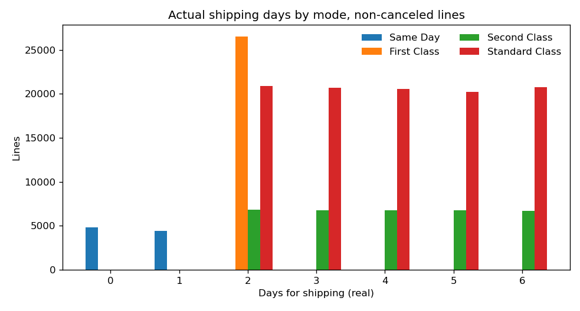

# Analyze — Late delivery risk (DataCo)

PACE stage: **Analyze**. This page checks the label, states the late rate, and cuts that rate by shipping mode, region, market, category, and department. It does not fit a classifier, a baseline, or a threshold. Those belong to Construct.

The checks below are what [the plan](01-plan.md) said Analyze would confirm. Every figure comes from `src/analyze_late_delivery.py` run on the local raw file (not re-downloaded). Aggregate tables are in `data/processed/`. The same population and the same grouped rates are defined in `sql/kpi_late_delivery.sql`. Charts are in `images/`. The raw CSV stays git-ignored. Personal-data values are not written under `data/processed/`.

## How I would say this in an interview

The business question is which orders miss the date the customer was promised, and whether the misses sit in a shipping mode, a region, or a category. The scorecard is the first job. The model is the second, and it is not fit here.

On the lines that were actually a delivery attempt, **98,977 of 172,765 are late**. That is a late rate of 0.5728996035076549 and an on-time rate of 0.4271003964923451 (73,788 / 172,765). Late is the majority class. A rule that says "everything is late" is right on that share of lines and does nothing operational. Accuracy is the wrong headline, which is why the plan already refused it.

The published flag and the day comparison agree on every one of those 172,765 lines: `Late_delivery_risk` is 1 exactly when `Days for shipping (real)` is greater than `Days for shipment (scheduled)`. They disagree on **4,423** lines, and every one of those is `Shipping canceled`, which the flag marks 0. A cancel is not a delivery. Those 7,754 canceled lines stay out of the denominator. The target stays the published flag. If the flag and the day comparison had disagreed inside the delivery population, this stage would have stopped and rewritten the target before any model.

What moves the rate is the promise, not the place. `Days for shipment (scheduled)` is a one-to-one relabeling of `Shipping Mode`: Same Day is 0, First Class is 1, Second Class is 2, Standard Class is 4. On non-canceled lines, First Class is late on **26,513 / 26,513**. Every one of those lines takes 2 days against a 1-day promise. There is no on-time First Class line in this file. Standard Class has the most late lines (41,023) and the lowest late rate (0.39769080879858076, 41,023 / 103,153), and its median slip is 0 days. Region median slip is 1 day in all 23 regions, and median lead time is 3 days in all 23. Inside a shipping mode, the five markets barely separate. That is a mix check, not a causal claim: the scorecard lead is the mode.

## What was checked

The plan's ten checks, then the KPIs on the population those checks justify.

1. Row and column count, and a Latin-1 read.
2. Distinct `Order Id` versus rows, and whether the shipping outcome is constant inside an order.
3. Cross-tab of `Late_delivery_risk` against `Delivery Status`.
4. The flag against real days minus scheduled days, including every disagreement, and including canceled and advance.
5. Canceled lines, and how the flag labels them.
6. Class balance on non-canceled lines. This is the first late rate this project states.
7. Nulls, especially on the candidate features.
8. Whether scheduled days are a one-to-one relabeling of `Shipping Mode`.
9. Cardinality of region, market, category, department, product, country, city, and state.
10. Personal-data columns, and a check that their values are not in `data/processed/`.

No model.

## 1. Shape and encoding

| Check | Result |
|---|---|
| File | `data/raw/DataCoSupplyChainDataset.csv` |
| Encoding used | **latin-1** |
| UTF-8 | Raises `UnicodeDecodeError`. The file is not UTF-8. |
| Rows | **180,519** |
| Columns | **53** |
| `tokenized_access_logs.csv` | Not read |

The plan's expected size was 180,519 × 53. That is the file. The script refuses a different shape.

## 2. Order Id is not the row

| Check | Result |
|---|---|
| Rows | 180,519 |
| Distinct `Order Id` | **65,752** |
| Distinct `Order Item Id` | **180,519** (0 duplicates) |
| Orders where `Shipping Mode` varies | **0** |
| Orders where `Late_delivery_risk` varies | **0** |
| Orders where real days vary | **0** |
| Orders where scheduled days vary | **0** |
| Orders where `Delivery Status` varies | **0** |
| Lines on an order | 1 to 5 |

An order is one to five lines. The shipping outcome does not change across those lines.

| Lines on the order | Orders | Line rows |
|---:|---:|---:|
| 1 | 19,850 | 19,850 |
| 2 | 11,447 | 22,894 |
| 3 | 11,398 | 34,194 |
| 4 | 11,704 | 46,816 |
| 5 | 11,353 | 56,765 |

The five order sizes account for 19,850 + 11,447 + 11,398 + 11,704 + 11,353 = 65,752 orders and 180,519 lines.

The plan said: if lines on one order disagree on the flag, publish an order-level rate as well. They do not disagree, so the KPI stays at **line** grain. An unweighted order rate was still computed, so the choice is visible. On non-canceled orders it is 36,048 / 62,897 = 0.5731274941571141. That number is in `order_grain_sensitivity.csv` and it is **not** the KPI. A five-line order counts five times in the line rate and once in that sensitivity. The two rates are close. Closeness is not a reason to change the grain the flag is stored on.

## 3. Flag against delivery status

Full counts. Rows are lines.

| Delivery Status | Flag 0 | Flag 1 | Lines |
|---|---:|---:|---:|
| Advance shipping | 41,592 | 0 | 41,592 |
| Late delivery | 0 | 98,977 | 98,977 |
| Shipping canceled | 7,754 | 0 | 7,754 |
| Shipping on time | 32,196 | 0 | 32,196 |
| All lines | 81,542 | 98,977 | 180,519 |

`Late_delivery_risk` = 1 is exactly `Delivery Status` = Late delivery (98,977 lines, and no others). Flag 0 is the other three statuses. Advance shipping is not a late delivery. The plan's reading of the flag holds on this file: early is not late, and a cancel is not flagged late either.

## 4. Flag against real days minus scheduled days

Slip is `Days for shipping (real)` minus `Days for shipment (scheduled)`. The day-rule for late is slip > 0. A disagreement is a line where the flag and that rule differ.

| Comparison | Lines |
|---|---:|
| Flag 1 and slip > 0 (agree) | 98,977 |
| Flag 0 and slip ≤ 0 (agree) | 77,119 |
| Flag 0 and slip > 0 (disagree) | 4,423 |
| Flag 1 and slip ≤ 0 (disagree) | 0 |
| All lines | 180,519 |

All 4,423 disagreements are `Shipping canceled`, and the flag is 0 on every one of them. There is no line that the flag calls late when the shipment met or beat the promise.

Every disagreement pattern, not a rollup. These eight rows sum to 4,423.

| Delivery Status | Shipping Mode | Flag | Real days | Scheduled days | Slip | Lines |
|---|---|---:|---:|---:|---:|---:|
| Shipping canceled | First Class | 0 | 2 | 1 | 1 | 1,301 |
| Shipping canceled | Same Day | 0 | 1 | 0 | 1 | 203 |
| Shipping canceled | Second Class | 0 | 3 | 2 | 1 | 306 |
| Shipping canceled | Second Class | 0 | 4 | 2 | 2 | 219 |
| Shipping canceled | Second Class | 0 | 5 | 2 | 3 | 280 |
| Shipping canceled | Second Class | 0 | 6 | 2 | 4 | 286 |
| Shipping canceled | Standard Class | 0 | 5 | 4 | 1 | 880 |
| Shipping canceled | Standard Class | 0 | 6 | 4 | 2 | 948 |

1,301 + 203 + 306 + 219 + 280 + 286 + 880 + 948 = 4,423.

Advance shipping is not a disagreement. It is flag 0 and a negative slip, and it happens only in Standard Class, whose promise is 4 days. Both patterns:

| Delivery Status | Shipping Mode | Flag | Real days | Scheduled days | Slip | Lines |
|---|---|---:|---:|---:|---:|---:|
| Advance shipping | Standard Class | 0 | 2 | 4 | −2 | 20,873 |
| Advance shipping | Standard Class | 0 | 3 | 4 | −1 | 20,719 |

20,873 + 20,719 = 41,592. No other mode has an advance line. The only negative slips that are not Advance shipping are canceled Standard Class lines: 793 with slip −2 and 981 with slip −1, in the canceled-agreement table below. Same Day, First Class, and Second Class have no negative slip on any line, canceled or not.

Shipping on time is flag 0 and slip 0. Three patterns, 32,196 lines:

| Delivery Status | Shipping Mode | Flag | Real days | Scheduled days | Slip | Lines |
|---|---|---:|---:|---:|---:|---:|
| Shipping on time | Same Day | 0 | 0 | 0 | 0 | 4,839 |
| Shipping on time | Second Class | 0 | 2 | 2 | 0 | 6,819 |
| Shipping on time | Standard Class | 0 | 4 | 4 | 0 | 20,538 |

4,839 + 6,819 + 20,538 = 32,196.

Canceled lines that agree with the flag (slip ≤ 0, flag 0). Five patterns, 3,331 lines:

| Delivery Status | Shipping Mode | Flag | Real days | Scheduled days | Slip | Lines |
|---|---|---:|---:|---:|---:|---:|
| Shipping canceled | Same Day | 0 | 0 | 0 | 0 | 241 |
| Shipping canceled | Second Class | 0 | 2 | 2 | 0 | 319 |
| Shipping canceled | Standard Class | 0 | 2 | 4 | −2 | 793 |
| Shipping canceled | Standard Class | 0 | 3 | 4 | −1 | 981 |
| Shipping canceled | Standard Class | 0 | 4 | 4 | 0 | 997 |

241 + 319 + 793 + 981 + 997 = 3,331. And 3,331 + 4,423 = 7,754 canceled lines.

The 26 patterns above are the whole file: 4,423 + 41,592 + 32,196 + 3,331 + 98,977 = 180,519. The agreeing late patterns are not repeated as their own grid here; they are the non-canceled day grid in the mode section, and they are all 98,977 lines with flag 1 and slip > 0. The machine-readable copy of all 26, agreements and disagreements, is `flag_vs_day_patterns.csv`.

On the non-canceled lines the disagreement count is **0**. The flag and the day-rule are the same label on the population the KPI uses. The plan said to keep `Late_delivery_risk` as the target only if this check agrees. It agrees. The target is not rewritten.

## 5. Canceled lines

| Check | Result |
|---|---|
| `Delivery Status` = Shipping canceled | **7,754** lines |
| Distinct orders among those lines | **2,855** |
| Flag 1 among canceled lines | **0** |
| Flag 0 among canceled lines | **7,754** |
| Of those, slip > 0 (the disagreements above) | **4,423** |
| Of those, slip ≤ 0 | **3,331** |

`Order Status` lines up with that delivery status exactly. `CANCELED` is 3,692 lines and `SUSPECTED_FRAUD` is 4,062 lines. 3,692 + 4,062 = 7,754. Both of those order statuses have no other delivery status. Every other order status has zero canceled lines. The KPI filter is still `Delivery Status`, which is what the plan named. The order-status identity is why a filter on `CANCELED` alone would be short by the 4,062 suspected-fraud lines.

Leaving the 7,754 lines in the denominator would count them as on time, because the flag is 0, including the 4,423 whose real days missed the promise. The exclusion stands.

## 6. Class balance, which is the late rate

The denominator is non-canceled lines. This is the first late rate this project states. It was computed here. It is not taken from another notebook.

| Population | Lines | Late lines | On-time lines | Late rate | On-time rate |
|---|---:|---:|---:|---:|---:|
| Non-canceled lines (the KPI) | 172,765 | 98,977 | 73,788 | 0.5728996035076549 | 0.4271003964923451 |
| All lines, cancels counted as not late (not the KPI) | 180,519 | 98,977 | 81,542 | 0.5482913155955883 | 0.4517086844044117 |

172,765 = 180,519 − 7,754. On-time on the KPI population is 73,788 = 41,592 advance + 32,196 shipping on time. Late is 98,977 / 172,765 = 0.5728996035076549. On-time delivery is 73,788 / 172,765 = 0.4271003964923451. They sum to 1.

Late is the majority class. The majority-class baseline the plan will score in Construct — predict late for every line — is correct on 0.5728996035076549 of non-canceled lines if it is scored there. That baseline is not fit in this stage. The share is the reason the plan will not lead with accuracy.

The all-lines late share, 98,977 / 180,519 = 0.5482913155955883, is what you get if canceled lines stay in and count as not late. It is written in `kpi_overall.csv` as `not_the_kpi_all_lines` so it is not reused by accident.

## 7. Nulls

Four columns have any null. None of them is a candidate feature.

| Column | Nulls | Share of 180,519 | Candidate feature | Personal data |
|---|---:|---:|---:|---:|
| Product Description | 180,519 | 1 | No | No |
| Order Zipcode | 155,679 | 0.8623967560201419 | No | No |
| Customer Lname | 8 | 8 / 180,519 | No | Yes |
| Customer Zipcode | 3 | 3 / 180,519 | No | No. Location field; not written. |

`Product Description` is empty on every row. It cannot be a feature. `Order Zipcode` is null on 155,679 / 180,519 lines and was not on the plan's feature list.

The plan's candidate features were checked as a set of 18 columns: shipping mode, scheduled days, order region, market, order country, category name, department name, product name, customer segment, order quantity, the price fields (`Order Item Product Price`, `Product Price`), the sales fields (`Sales`, `Sales per customer`, `Order Item Total`), the discount fields (`Order Item Discount`, `Order Item Discount Rate`), and `order date (DateOrders)`. **Nulls on that set: 0.**

`Customer Segment` has 3 levels. It is a candidate feature. A late rate by segment was not one of the scorecard cuts, so it is not stated here.

## 8. Scheduled days are the shipping mode

Checked on all 180,519 lines, canceled included, because the promise is set whether or not the line is later canceled. Each mode has one scheduled value, and each scheduled value has one mode.

| Shipping Mode | Days for shipment (scheduled) | Lines |
|---|---:|---:|
| Same Day | 0 | 9,737 |
| First Class | 1 | 27,814 |
| Second Class | 2 | 35,216 |
| Standard Class | 4 | 107,752 |

9,737 + 27,814 + 35,216 + 107,752 = 180,519. There is no second scheduled value hiding inside a mode.

The two columns are the same fact. A model that takes both double-counts the promise. Construct should use one. `Shipping Mode` is the one a fulfillment lead can say out loud. Scheduled days are the numeric form of that label, not a second measurement.

## 9. Cardinality

Distinct values on the full file, before the cancel filter. This is the count a one-hot encoder would see if it were pointed at the column.

| Column | Distinct values |
|---|---:|
| Order Region | 23 |
| Market | 5 |
| Category Name | 50 |
| Department Name | 11 |
| Product Name | 118 |
| Order Country | 164 |
| Order City | 3,597 |
| Order State | 1,089 |
| Customer Segment | 3 |
| Shipping Mode | 4 |
| Delivery Status | 4 |
| Order Status | 9 |

How rare the high-cardinality levels are, still on all lines. Where the two central levels have different line counts, both are shown. They are not averaged into a level size nobody has.

| Column | Levels | Min lines | Median lines (low, high) | Max lines | Levels with 1 line | Levels with under 30 lines |
|---|---:|---:|---|---:|---:|---:|
| Product Name | 118 | 10 | 281, 282 | 24,515 | 0 | 7 |
| Order Country | 164 | 1 | 152, 163 | 24,840 | 2 | 41 |
| Order City | 3,597 | 1 | 20, 20 | 2,211 | 69 | 2,270 |
| Order State | 1,089 | 1 | 41, 41 | 6,722 | 16 | 459 |

`Order City` and `Order State` are not on the plan's feature list, and a one-hot of 3,597 cities or 1,089 states would memorize rare places. `Order Country` is allowed by the plan and has 164 levels, 41 of them under 30 lines. `Product Name` has 118 levels, a floor of 10 lines, and 7 names under 30. The plan already said to drop the raw product name if it only memorizes rare items. 118 is not thousands. It is still a long one-hot next to category (50) and department (11).

Some stored labels have a trailing space or a doubled space. Stripping and collapsing whitespace does **not** merge any levels: the distinct count is unchanged for category, department, region, and product name. The strings still have to be kept as stored, or a filter will miss them. The ones that appear in the scorecard tables below are Category Name: `Cameras `, `Books `, `CDs `, `Baby `, `As Seen on  TV!`; Department Name: `Health and Beauty `; Order Region: `West of USA `, `US Center `, `South of  USA `. Product-name spellings with the same issue are listed in `whitespace_labels.csv` and are not repeated here.

Two hierarchy breaks, both on the full file (these counts are not the KPI denominator):

- `Category Name` = Electronics is two ids in two departments: Category Id 13 in Footwear (1,127 lines) and Category Id 37 in Outdoors (2,029 lines). One-hot of the name glues them together. One-hot of the id splits them. No other category name crosses a department. No product name crosses a category.
- `Order Country` = Estados Unidos is the only country in more than one region: East of USA (6,915), `South of  USA ` (4,045), `US Center ` (5,887), and `West of USA ` (7,993), all in market USCA. No region sits in more than one market.

`Product Status` has 1 distinct value (0). It cannot separate late from on time.

## 10. Personal data

These columns are names, an email, a password, or a street. They are not candidate features. Their values are not written to `data/processed/`. `null_counts.csv` records the column name, the null count, and the distinct count. It does not record a name, an address, or the placeholder stored in the email and password columns.

| Column | Nulls | Distinct non-null values | Written to `data/processed/` |
|---|---:|---:|---|
| Customer Fname | 0 | 782 | No |
| Customer Lname | 8 | 1,109 | No |
| Customer Email | 0 | 1 | No |
| Customer Password | 0 | 1 | No |
| Customer Street | 0 | 7,458 | No |

Customer email and customer password are each a single repeated value. They would not predict anything even before the privacy rule. They are still personal-data columns, and they are not saved.

Also not written, and not used as features here: Customer City, Customer State, Customer Country, Customer Zipcode, Latitude, Longitude, Order Zipcode. The processed files are aggregates. The largest has 92 rows (`late_rate_by_mode_and_region.csv`). Nothing row-level was saved, and the raw CSV was not copied into git.

## KPIs

Population: `Delivery Status` ≠ Shipping canceled. Grain: order line. Both are commented on every rate query in `sql/kpi_late_delivery.sql`. The SQL was run on a SQLite table loaded from the scorecard columns only (no personal-data columns) and matched these line counts and late counts for mode, region, market, category, department, and mode × market.

### Lead time and schedule slip

On the 172,765 non-canceled lines.

| KPI | Result |
|---|---|
| On-time delivery rate | 73,788 / 172,765 = 0.4271003964923451 |
| Late rate | 98,977 / 172,765 = 0.5728996035076549 |
| Median lead time (real days) | **3** |
| Mean lead time | 604,435 / 172,765 = 3.4985963592162763 |
| Median schedule slip (real − scheduled) | **1** |
| Mean schedule slip | 97,698 / 172,765 = 0.5654964836627789 |

The count of lines is odd (172,765), and both central observations are the same day, so the median is that day rather than an average of two days. The same is true of every mode, region, market, category, and department median reported below: the script stops if the two central values differ.

The median lead of 3 days is the pooled line. It is not the median of any shipping mode (below: 0, 2, 4, and 4). The median slip of 1 day is also the pool. A fulfillment lead who manages to "3 days, usually 1 day late" is managing a mixture.

Mean lead is 3.4985963592162763 against a median of 3, because the right tail of real days reaches 6. Mean slip is 0.5654964836627789 against a median of 1, because Standard Class, the largest mode, has a mean slip below 0 and pulls the pool down. The median is the typical line. The mean is the pull from the tail. Both are reported because the plan asked for both.

### Shipping mode

Sorted by late rate, descending. The line count is beside the rate on purpose. Standard Class has the most late lines and the lowest late rate.

| Shipping Mode | Lines | Late lines | Late rate | Median slip | Mean slip | Median lead | Mean lead |
|---|---:|---:|---:|---:|---:|---:|---:|
| First Class | 26,513 | 26,513 | 1.0 | 1 | 1.0 | 2 | 2.0 |
| Second Class | 33,806 | 26,987 | 0.7982902443353251 | 2 | 1.9931668934508666 | 4 | 3.9931668934508666 |
| Same Day | 9,293 | 4,454 | 0.47928548369740664 | 0 | 0.47928548369740664 | 0 | 0.47928548369740664 |
| Standard Class | 103,153 | 41,023 | 0.39769080879858076 | 0 | -0.006301319399338846 | 4 | 3.9936986806006614 |

26,513 + 33,806 + 9,293 + 103,153 = 172,765. Late lines: 26,513 + 26,987 + 4,454 + 41,023 = 98,977.

First Class is not a high-risk slice inside a varying outcome. It does not vary. Scheduled days are 1 and real days are 2 on all 26,513 non-canceled First Class lines, so slip is 1 and the flag is 1. Mean slip is 26,513 / 26,513 = 1. Mean lead is 53,026 / 26,513 = 2. A shipping-mode baseline that has seen First Class in training will label every later First Class line late and will be right on this file. That is the comparison the plan set up. It is not fit here. It is why a model that "beats" a naive accuracy score may only be reading the mode.

Same Day promises 0 days. Real days are 0 or 1. Slip equals real days, and the late flag equals slip, so the late rate, the mean slip, and the mean lead are the same number: 4,454 / 9,293 = 0.47928548369740664. Median slip is 0 because 4,454 is under half of 9,293. The typical Same Day line meets a same-day promise. Just under half do not, and when they miss they miss by one day.

Second Class promises 2 days. Median lead is 4, so median slip is 2. The late rate is 26,987 / 33,806 = 0.7982902443353251. Mean slip is 67,381 / 33,806 = 1.9931668934508666. The on-time lines are the 6,819 with real days exactly 2. Everything from 3 through 6 days is late.

Standard Class promises 4 days. Median lead is 4, so median slip is 0: the typical Standard Class line meets the promise. The late rate is still 41,023 / 103,153 = 0.39769080879858076, which is the lines with real days of 5 or 6. Mean slip is −650 / 103,153 = -0.006301319399338846. The negative mean is the early lines (slip −2 and −1) outweighing the late lines in the sum of days, not in the count of lines. On-time lines are 103,153 − 41,023 = 62,130, which is more than the late lines. "Lowest late rate" and "usually on time" are both true. "Not a problem" is not. 41,023 is the largest late count in the file.

The day grid that produces those rates, non-canceled lines only:

| Shipping Mode | Scheduled | Real days | Delivery Status | Flag | Slip | Lines |
|---|---:|---:|---|---:|---:|---:|
| Same Day | 0 | 0 | Shipping on time | 0 | 0 | 4,839 |
| Same Day | 0 | 1 | Late delivery | 1 | 1 | 4,454 |
| First Class | 1 | 2 | Late delivery | 1 | 1 | 26,513 |
| Second Class | 2 | 2 | Shipping on time | 0 | 0 | 6,819 |
| Second Class | 2 | 3 | Late delivery | 1 | 1 | 6,759 |
| Second Class | 2 | 4 | Late delivery | 1 | 2 | 6,759 |
| Second Class | 2 | 5 | Late delivery | 1 | 3 | 6,772 |
| Second Class | 2 | 6 | Late delivery | 1 | 4 | 6,697 |
| Standard Class | 4 | 2 | Advance shipping | 0 | -2 | 20,873 |
| Standard Class | 4 | 3 | Advance shipping | 0 | -1 | 20,719 |
| Standard Class | 4 | 4 | Shipping on time | 0 | 0 | 20,538 |
| Standard Class | 4 | 5 | Late delivery | 1 | 1 | 20,231 |
| Standard Class | 4 | 6 | Late delivery | 1 | 2 | 20,792 |

Inside Second Class the four late day-counts are 6,759, 6,759, 6,772, and 6,697. Inside Standard Class the five real-day counts run from 20,231 to 20,873. The rate is what you get when real days only land on a short list of integers and the promise is a single cut on that list. This stage does not call that a property of a carrier outside this file. It is the description of these lines.

### Order region and market

Every region has median slip **1** and median lead **3**. The median does not rank regions. The late rate does, and the band is narrow next to the mode gap (First Class at 1.0, Standard Class at 0.39769080879858076).

| Order Region | Lines | Late lines | Late rate | Median slip | Mean slip | Median lead |
|---|---:|---:|---:|---:|---:|---:|
| Central Africa | 1,616 | 972 | 0.6014851485148515 | 1 | 0.6280940594059405 | 3 |
| Western Europe | 25,867 | 15,140 | 0.5853017358023737 | 1 | 0.5963582943518769 | 3 |
| `South of  USA ` | 3,855 | 2,256 | 0.5852140077821012 | 1 | 0.5966277561608301 | 3 |
| South Asia | 7,455 | 4,350 | 0.5835010060362174 | 1 | 0.5965124077800135 | 3 |
| East Africa | 1,781 | 1,036 | 0.5816956765861875 | 1 | 0.5889949466591803 | 3 |
| East of USA | 6,617 | 3,849 | 0.5816835423908115 | 1 | 0.5853105636995617 | 3 |
| Southeast Asia | 9,136 | 5,297 | 0.5797942206654991 | 1 | 0.5552758318739054 | 3 |
| West Asia | 5,746 | 3,322 | 0.5781413156978767 | 1 | 0.5750087017055343 | 3 |
| Eastern Europe | 3,785 | 2,182 | 0.5764861294583884 | 1 | 0.5854689564068692 | 3 |
| `US Center ` | 5,653 | 3,252 | 0.5752697682646383 | 1 | 0.6010967627808244 | 3 |
| South America | 14,184 | 8,111 | 0.5718415115623238 | 1 | 0.5559785673998872 | 3 |
| Central America | 27,174 | 15,518 | 0.5710605726061677 | 1 | 0.5578862147641127 | 3 |
| North Africa | 3,086 | 1,762 | 0.5709656513285807 | 1 | 0.5570317563188594 | 3 |
| Southern Europe | 9,030 | 5,129 | 0.5679955703211517 | 1 | 0.5128460686600221 | 3 |
| `West of USA ` | 7,595 | 4,313 | 0.5678736010533245 | 1 | 0.5598420013166557 | 3 |
| Eastern Asia | 6,973 | 3,955 | 0.5671877240785889 | 1 | 0.5640326975476839 | 3 |
| Central Asia | 542 | 306 | 0.5645756457564576 | 1 | 0.6309963099630996 | 3 |
| Oceania | 9,733 | 5,482 | 0.5632384670707901 | 1 | 0.5592314805301551 | 3 |
| Northern Europe | 9,408 | 5,292 | 0.5625 | 1 | 0.5433673469387755 | 3 |
| Southern Africa | 1,100 | 617 | 0.5609090909090909 | 1 | 0.48 | 3 |
| Caribbean | 7,951 | 4,415 | 0.55527606590366 | 1 | 0.5396805433278833 | 3 |
| West Africa | 3,571 | 1,953 | 0.546905628675441 | 1 | 0.548025763091571 | 3 |
| Canada | 907 | 468 | 0.515986769570011 | 1 | 0.37816979051819183 | 3 |

The highest late rate is Central Africa: 972 / 1,616 = 0.6014851485148515. The lowest is Canada: 468 / 907 = 0.515986769570011. The largest region by lines is Central America, 15,518 / 27,174 = 0.5710605726061677, near the overall rate, not near the top of the ranking. Western Europe is second by lines (15,140 / 25,867 = 0.5853017358023737) and second by rate. A high rate on 1,616 lines is not the same fact as a high rate on 25,867 lines. Mean slip is where Canada actually separates: 0.37816979051819183 versus Central Africa 0.6280940594059405. Median slip still says 1 in both.

Market is the rollup. The spread is smaller than the region spread, and the medians match again.

| Market | Lines | Late lines | Late rate | Median slip | Mean slip | Median lead |
|---|---:|---:|---:|---:|---:|---:|
| Europe | 48,090 | 27,743 | 0.5768974838843834 | 1 | 0.5694531087544188 | 3 |
| USCA | 24,627 | 14,138 | 0.5740853534738295 | 1 | 0.5752223169691801 | 3 |
| Pacific Asia | 39,585 | 22,712 | 0.5737526840975117 | 1 | 0.5694581280788177 | 3 |
| LATAM | 49,309 | 28,044 | 0.5687399866150196 | 1 | 0.5544018333367133 | 3 |
| Africa | 11,154 | 6,340 | 0.5684059530213377 | 1 | 0.5619508696431773 | 3 |

48,090 + 24,627 + 39,585 + 49,309 + 11,154 = 172,765. Europe is the highest market rate, 27,743 / 48,090 = 0.5768974838843834. Africa is the lowest, 6,340 / 11,154 = 0.5684059530213377. That market range is much smaller than the mode range, from First Class at 1.0 to Standard Class at 0.39769080879858076.

### Do region differences survive the mode mix?

This is a cross-tab, not a cause. Late rate by shipping mode inside market, on the same non-canceled lines:

| Shipping Mode | Market | Lines | Late lines | Late rate | Median slip |
|---|---|---:|---:|---:|---:|
| First Class | Europe | 7,562 | 7,562 | 1.0 | 1 |
| First Class | LATAM | 7,471 | 7,471 | 1.0 | 1 |
| First Class | Pacific Asia | 5,991 | 5,991 | 1.0 | 1 |
| First Class | USCA | 3,814 | 3,814 | 1.0 | 1 |
| First Class | Africa | 1,675 | 1,675 | 1.0 | 1 |
| Same Day | LATAM | 2,528 | 1,273 | 0.5035601265822784 | 1 |
| Same Day | Europe | 2,624 | 1,281 | 0.4881859756097561 | 0 |
| Same Day | USCA | 1,372 | 637 | 0.4642857142857143 | 0 |
| Same Day | Africa | 634 | 294 | 0.4637223974763407 | 0 |
| Same Day | Pacific Asia | 2,135 | 969 | 0.453864168618267 | 0 |
| Second Class | Pacific Asia | 7,829 | 6,293 | 0.8038063609656406 | 2 |
| Second Class | Europe | 9,470 | 7,596 | 0.8021119324181626 | 2 |
| Second Class | Africa | 2,091 | 1,675 | 0.8010521281683405 | 2 |
| Second Class | USCA | 4,918 | 3,913 | 0.7956486376575844 | 2 |
| Second Class | LATAM | 9,498 | 7,510 | 0.7906927774268268 | 2 |
| Standard Class | Pacific Asia | 23,630 | 9,459 | 0.4002962336013542 | 0 |
| Standard Class | Africa | 6,754 | 2,696 | 0.39917086171157834 | 0 |
| Standard Class | USCA | 14,523 | 5,774 | 0.397576258348826 | 0 |
| Standard Class | Europe | 28,434 | 11,304 | 0.3975522262080608 | 0 |
| Standard Class | LATAM | 29,812 | 11,790 | 0.3954783308734738 | 0 |

First Class is 1.0 in all five markets. Standard Class runs from LATAM 11,790 / 29,812 = 0.3954783308734738 to Pacific Asia 9,459 / 23,630 = 0.4002962336013542. Second Class runs from LATAM 7,510 / 9,498 = 0.7906927774268268 to Pacific Asia 6,293 / 7,829 = 0.8038063609656406. Same Day is the widest market spread inside a mode, and it is the smallest mode: Pacific Asia 969 / 2,135 = 0.453864168618267 to LATAM 1,273 / 2,528 = 0.5035601265822784. None of those within-mode market gaps looks like the gap between First Class and Standard Class.

A second description, still not causal: for each region, compare its late rate to the rate implied by its own mode mix, using each mode's overall late rate. Implied rate = sum over modes of (region share of that mode × overall late rate of that mode). The overall mode rate includes the region, so this is not a held-out adjustment. `region_rate_vs_mode_mix.csv` has all 23. The largest absolute gap is Canada. The highest-rate region and the two largest regions are here so the ranking is not only the tails.

| Order Region | Lines | Late rate | Rate implied by mode mix | Actual minus implied |
|---|---:|---:|---:|---:|
| Central Africa | 1,616 | 0.6014851485148515 | 0.5774323745239486 | 0.0240527739909028 |
| Western Europe | 25,867 | 0.5853017358023737 | 0.5783972918059168 | 0.0069044439964568 |
| Central America | 27,174 | 0.5710605726061677 | 0.571921138363001 | -0.0008605657568332 |
| Canada | 907 | 0.515986769570011 | 0.5812091342108915 | -0.0652223646408804 |

Central America's gap (actual minus implied) is -0.0008605657568332. Western Europe's gap is 0.0069044439964568. Central Africa's gap is 0.0240527739909028, on 1,616 lines. Canada's gap is -0.0652223646408804, on 907 lines. Canada is not low because it avoids First Class. Its First Class lines are still all late. The miss versus the mix shows up inside the mode.

Worst region by late rate, Central Africa, by mode:

| Shipping Mode | Lines | Late lines | Late rate | Median slip |
| --- | ---: | ---: | ---: | ---: |
| First Class | 278 | 278 | 1.0 | 1 |
| Second Class | 291 | 241 | 0.8281786941580757 | 2 |
| Standard Class | 968 | 429 | 0.4431818181818182 | 0 |
| Same Day | 79 | 24 | 0.3037974683544304 | 0 |

Best region by late rate, Canada, by mode:

| Shipping Mode | Lines | Late lines | Late rate | Median slip |
| --- | ---: | ---: | ---: | ---: |
| First Class | 170 | 170 | 1.0 | 1 |
| Second Class | 154 | 125 | 0.8116883116883117 | 2 |
| Standard Class | 554 | 166 | 0.2996389891696751 | -1 |
| Same Day | 29 | 7 | 0.2413793103448276 | 0 |

Canada Standard Class is 166 / 554 = 0.2996389891696751, against the overall Standard Class rate of 0.39769080879858076, and it is the only region where Standard Class median slip is not 0. The median there is −1, on 554 lines. Central Africa Standard Class is 429 / 968 = 0.4431818181818182. Same Day in Central Africa is 24 / 79 = 0.3037974683544304; in Canada it is 7 / 29 = 0.2413793103448276. Those Same Day cells are small. In 8 of 23 regions the Same Day median slip is 1 rather than the global Same Day median of 0. That happens when more than half of that region's Same Day lines have real days = 1, which is the late flag for that mode. It is the median of a two-point outcome crossing one half, not a separate regional clock.

Read this as: after holding mode fixed, market does not carry a late-rate gap that would change the scorecard, and most regions sit near the rate their mode mix already implies. Canada is the exception in the table, it is 907 lines, and the within-mode piece a person can see is 166 late Standard Class lines out of 554. That is not a basis for a regional program by itself, and it is not a claim that region has no association at all.

### Category and department

Median slip is 1 for 49 of 50 categories. The exception is Men's Golf Clubs, 135 / 274 = 0.4927007299270073, median slip 0. Median lead is 3 for 42 categories and 4 for the other 8 (As Seen on  TV!, Strength Training, Kids' Golf Clubs, Video Games, DVDs, Children's Clothing, Soccer, Computers). The rate ranking is real and the volume is not lined up with it.

The highest rate is Golf Bags & Carts, 42 / 61 = 0.6885245901639344. The lowest is Men's Golf Clubs. The largest categories sit on the overall rate: Cleats 13,496 / 23,514 = 0.5739559411414477, Men's Footwear 12,121 / 21,263 = 0.5700512627569017, Women's Apparel 11,476 / 20,116 = 0.5704911513223305, Indoor/Outdoor Games 10,565 / 18,470 = 0.5720086626962642, Fishing 9,516 / 16,595 = 0.5734257306417596. A category manager who starts with Golf Bags is starting with 61 lines.

| Category Name | Lines | Late lines | Late rate | Median slip | Median lead |
|---|---:|---:|---:|---:|---:|
| Golf Bags & Carts | 61 | 42 | 0.6885245901639344 | 1 | 3 |
| Lacrosse | 329 | 206 | 0.6261398176291794 | 1 | 3 |
| Pet Supplies | 472 | 290 | 0.614406779661017 | 1 | 3 |
| `Cameras ` | 562 | 344 | 0.6120996441281139 | 1 | 3 |
| Accessories | 1,697 | 1,014 | 0.5975250441956393 | 1 | 3 |
| Music | 417 | 248 | 0.5947242206235012 | 1 | 3 |
| Fitness Accessories | 296 | 176 | 0.5945945945945946 | 1 | 3 |
| Boxing & MMA | 402 | 238 | 0.5920398009950248 | 1 | 3 |
| Crafts | 458 | 271 | 0.5917030567685589 | 1 | 3 |
| `As Seen on  TV!` | 66 | 39 | 0.5909090909090909 | 1 | 4 |
| Sporting Goods | 336 | 198 | 0.5892857142857143 | 1 | 3 |
| Strength Training | 109 | 64 | 0.5871559633027523 | 1 | 4 |
| `Books ` | 391 | 229 | 0.5856777493606138 | 1 | 3 |
| Electronics | 3,024 | 1,770 | 0.5853174603174603 | 1 | 3 |
| Trade-In | 926 | 542 | 0.5853131749460043 | 1 | 3 |
| Golf Gloves | 1,029 | 602 | 0.5850340136054422 | 1 | 3 |
| Girls' Apparel | 1,137 | 664 | 0.5839929639401935 | 1 | 3 |
| Health and Beauty | 346 | 202 | 0.5838150289017341 | 1 | 3 |
| Tennis & Racquet | 314 | 183 | 0.5828025477707006 | 1 | 3 |
| Hunting & Shooting | 424 | 247 | 0.5825471698113207 | 1 | 3 |
| Consumer Electronics | 409 | 238 | 0.5819070904645477 | 1 | 3 |
| Women's Clothing | 631 | 367 | 0.5816164817749604 | 1 | 3 |
| Golf Shoes | 502 | 291 | 0.5796812749003984 | 1 | 3 |
| Garden | 466 | 270 | 0.5793991416309013 | 1 | 3 |
| Basketball | 64 | 37 | 0.578125 | 1 | 3 |
| Shop By Sport | 10,515 | 6,058 | 0.5761293390394674 | 1 | 3 |
| Kids' Golf Clubs | 356 | 205 | 0.5758426966292135 | 1 | 4 |
| Baseball & Softball | 607 | 349 | 0.5749588138385503 | 1 | 3 |
| Toys | 507 | 291 | 0.5739644970414202 | 1 | 3 |
| Cleats | 23,514 | 13,496 | 0.5739559411414477 | 1 | 3 |
| Golf Balls | 1,403 | 805 | 0.5737704918032787 | 1 | 3 |
| Fishing | 16,595 | 9,516 | 0.5734257306417596 | 1 | 3 |
| Water Sports | 14,880 | 8,517 | 0.5723790322580645 | 1 | 3 |
| Indoor/Outdoor Games | 18,470 | 10,565 | 0.5720086626962642 | 1 | 3 |
| Men's Clothing | 198 | 113 | 0.5707070707070707 | 1 | 3 |
| Women's Golf Clubs | 170 | 97 | 0.5705882352941176 | 1 | 3 |
| Women's Apparel | 20,116 | 11,476 | 0.5704911513223305 | 1 | 3 |
| Men's Footwear | 21,263 | 12,121 | 0.5700512627569017 | 1 | 3 |
| Cardio Equipment | 11,948 | 6,805 | 0.5695513893538667 | 1 | 3 |
| Camping & Hiking | 13,157 | 7,487 | 0.5690506954472904 | 1 | 3 |
| Video Games | 804 | 455 | 0.5659203980099502 | 1 | 4 |
| DVDs | 459 | 259 | 0.5642701525054467 | 1 | 4 |
| Hockey | 588 | 329 | 0.5595238095238095 | 1 | 3 |
| Children's Clothing | 622 | 348 | 0.5594855305466238 | 1 | 4 |
| Soccer | 136 | 75 | 0.5514705882352942 | 1 | 4 |
| `Baby ` | 198 | 109 | 0.5505050505050505 | 1 | 3 |
| `CDs ` | 263 | 141 | 0.5361216730038023 | 1 | 3 |
| Golf Apparel | 429 | 229 | 0.5337995337995338 | 1 | 3 |
| Computers | 425 | 224 | 0.5270588235294118 | 1 | 4 |
| Men's Golf Clubs | 274 | 135 | 0.4927007299270073 | 0 | 3 |

Department is the rollup. Every department has median slip 1 and median lead 3. The highest rate is Pet Shop, 290 / 472 = 0.614406779661017. That department is the category Pet Supplies: same 472 lines, same 290 late lines. Book Shop is the category `Books ` (229 / 391). `Health and Beauty ` the department is the category Health and Beauty (202 / 346). Those three department rates are not a second fact. Fan Shop is the volume: 36,623 / 64,033 = 0.5719394687114456, next to the overall rate.

| Department Name | Lines | Late lines | Late rate | Median slip | Median lead |
|---|---:|---:|---:|---:|---:|
| Pet Shop | 472 | 290 | 0.614406779661017 | 1 | 3 |
| Book Shop | 391 | 229 | 0.5856777493606138 | 1 | 3 |
| `Health and Beauty ` | 346 | 202 | 0.5838150289017341 | 1 | 3 |
| Fitness | 2,374 | 1,377 | 0.5800336983993261 | 1 | 3 |
| Outdoors | 9,267 | 5,375 | 0.5800151073702384 | 1 | 3 |
| Technology | 1,396 | 806 | 0.5773638968481375 | 1 | 3 |
| Golf | 31,768 | 18,198 | 0.5728405943087383 | 1 | 3 |
| Footwear | 13,891 | 7,949 | 0.5722410193650566 | 1 | 3 |
| Apparel | 46,884 | 26,825 | 0.5721568125586554 | 1 | 3 |
| Fan Shop | 64,033 | 36,623 | 0.5719394687114456 | 1 | 3 |
| Discs Shop | 1,943 | 1,103 | 0.5676788471435924 | 1 | 3 |

Category lines sum to 172,765 and late lines sum to 98,977. Department lines and late lines do the same. The department table is a rollup of the category table, with the Electronics name sitting inside the rollup as one category even though its ids cross Footwear and Outdoors (section 9). The late rate was not recomputed on those two ids separately; the hierarchy counts in section 9 are all lines, not this denominator.

## Shipping date is an outcome field

The plan allows calendar parts of the order date and forbids the shipping date if that date is when the goods moved. The check:

| Check | Result |
|---|---|
| Order timestamp, min | 2015-01-01 00:00:00 |
| Order timestamp, max | 2018-01-31 23:38:00 |
| Shipping timestamp, min | 2015-01-03 00:00:00 |
| Shipping timestamp, max | 2018-02-06 22:14:00 |
| Shipping timestamp before the order timestamp | **0** |
| Calendar-day gap equals real days | **180,519 / 180,519** |
| 24-hour truncation equals real days | **175,862 / 180,519** |
| Rows where the 24-hour truncation is 0 and real days are 1 | **4,657** |

Both timestamps parsed with `%m/%d/%Y %H:%M` on every row. The script stops if a value does not match that format. The calendar-day gap (the date part of the shipping timestamp minus the date part of the order timestamp) equals `Days for shipping (real)` on every row. A truncation to whole 24-hour periods does not: 4,657 lines have a truncated gap of 0 and real days of 1. Those are not a second definition of lateness. They are why "subtract the timestamps and take `.days`" is the wrong reconstruction of the column. The column itself matches the calendar dates.

`shipping date (DateOrders)` is the outcome clock. It is not a feature. `order date (DateOrders)` is known at order time. Its calendar parts stay allowed. Neither date is turned into a model input in this stage.

## Decisions this stage locks

| Decision | Choice | Why |
|---|---|---|
| Target | `Late_delivery_risk` | On 172,765 non-canceled lines it matches real days > scheduled days with 0 disagreements. The 4,423 disagreements are all canceled and all flagged 0. |
| KPI population | Drop `Shipping canceled` (7,754 lines, 2,855 orders) | The flag calls every one of them on time, including 4,423 that missed the day-rule. A cancel is not an on-time delivery. |
| Grain | Order line | The flag does not vary inside an `Order Id`. The order-level sensitivity (36,048 / 62,897) is not a second KPI. |
| Scheduled days | Same fact as `Shipping Mode` | One-to-one map: 0, 1, 2, 4. Use one column in a model, not both. |
| Shipping date | Outcome field | Calendar-day gap equals real days on 180,519 / 180,519 rows. |
| What the scorecard leads with | Shipping mode | First Class is 26,513 / 26,513 late. Standard Class is the low rate and the high late count. Region median slip does not move. |
| Personal data | Not in `data/processed/` | Names, email, password, street, and the location fields listed in section 10. |
| Model | Not fit | Class balance is measured. The majority share is the late rate above. Construct scores the baselines. |

## Before Construct

One decision is not locked by the plan, and it changes the training rows.

The plan fixed the **KPI** denominator as non-canceled lines. It did not write the same sentence for the training set. The recommendation from this stage is: train and score on the non-canceled lines, the same 172,765. That is the population where the flag and the day-rule are the same label. If the 7,754 canceled lines stay in training, the model is shown 4,423 lines that missed the promise and are labeled 0, plus 3,331 canceled lines that did not miss it, also labeled 0. Confirm that exclusion before Construct. If the canceled lines are supposed to stay in, say so and the target note in section 4 has to be rewritten first. This stage did not fit either version.

The rest follows from the tables, and Construct should not reopen it quietly:

- Do not give the model `Delivery Status`, `Days for shipping (real)`, `Late_delivery_risk`, or `shipping date (DateOrders)`.
- Do not give it both `Shipping Mode` and scheduled days.
- Do not one-hot `Order City` (3,597) or `Order State` (1,089). Treat `Order Country` (164) and `Product Name` (118) as a cardinality decision, not as a default one-hot. `Category Name` = Electronics is Category Id 13 and Category Id 37; encoding the name merges them.
- Expect the shipping-mode baseline to classify every non-canceled First Class line correctly, because that class does not vary. The interesting comparison is whether anything else beats the mode on Second Class, Same Day, and Standard Class, where the flag still varies.
- No dollar cost per late day. The file still does not state a penalty. No Tableau and no executive writeup in this stage.

Construct and Execute are not done in this file.
