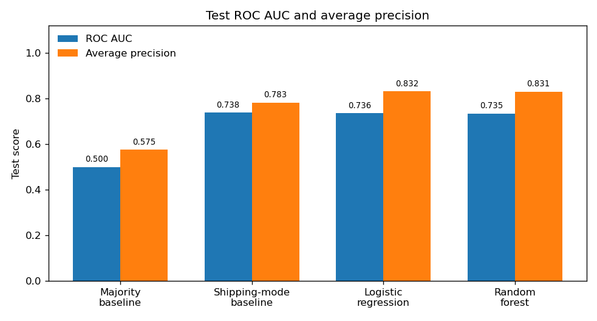

# Construct — Late delivery risk (DataCo)

PACE stage: **Construct**. This page fits two baselines, a logistic regression, and one random forest, then scores them on held-out orders. It does not pick an operating threshold, a dollar cost, or a dashboard. Those belong to Execute.

Every figure below is from one run of `src/construct_late_delivery.py` on the local raw file (Latin-1, not re-downloaded). The metric tables are in `data/processed/construct_*.csv`. The chart is `images/test_auc_ap_by_model.png`. The raw CSV stays git-ignored. No row-level prediction file was written. Personal-data values are not in `data/processed/`.

## How I would say this in an interview

The model does not beat the shipping mode. On orders held out of training, the shipping-mode baseline has test ROC AUC **0.7383939473457695**. Logistic regression is **0.736119769260069**, which is 0.002274178085700518 lower. The random forest is **0.7347929101103273**, which is 0.0036010372354421394 lower. The denominator is the same 19,722 late test lines out of 34,272 test lines.

Asked to flag the same share of lines as the training late rate (19,613 of 34,272), the mode baseline catches **13,828 / 19,722** late lines (recall 0.7011459284048271). Logistic catches **13,790 / 19,722** (0.699219146131224). The forest catches **13,762 / 19,722** (0.6977994118243586). Both models are slightly worse, not better.

Average precision is higher for the two models (logistic 0.8316662942992936, forest 0.8311088837063084, mode baseline 0.7831387247952716). That gap is not a found signal. The mode baseline has one score per mode, and scikit-learn's average precision steps once per tied score, using the precision after the whole tie. A seeded shuffle that reorders lines only inside a mode, and does not reorder the modes, moves the baseline's average precision to **0.8329247801265168**. Logistic is then 0.0012584858272232102 below that shuffle, and the forest is 0.0018158964202084071 below it. Inside Second Class, Same Day, and Standard Class, where the flag still varies, both models have ROC AUC at or below one half, except the forest on Same Day (0.504845730587073).

The logistic coefficient on First Class, versus Standard Class, is 8.447707958906731. The next-largest coefficient that is not a shipping mode is Canada, at -0.3189522719578486. The forest puts 0.9308387729436968 of its impurity importance on the four shipping-mode levels. The honest recommendation is to manage the mode. It is not to deploy either classifier.

## What was built

Population is the one Analyze locked: `Delivery Status` is not `Shipping canceled`. The script stops unless that is 172,765 lines and 98,977 late lines, and unless the flag equals real days greater than scheduled days on every one of those lines. Real days are used for that check and then dropped. They are not a feature.

| Piece | What it is |
|---|---|
| Majority baseline | Training majority label for every test line. Ranking score is the training late rate, a constant. |
| Shipping-mode baseline | Late rate of each mode on training rows only, applied to test. This is the bar. |
| Logistic regression | scikit-learn 1.9.1, L2 (`l1_ratio` 0), `C` 1.0, `lbfgs`. Converged in 26 iterations (cap 2,000). |
| Random forest | 200 trees, `min_samples_leaf` 50, `max_features` sqrt, `random_state` 42, one process. |

One tree model, not a search. A forest, not gradient boosting: the plan asked for interactions a single coefficient misses, and a forest's impurity importance does not need a learning rate or a tree-count search. This stage is not a tuning study. No XGBoost. No fifth model.

Outputs:

| File | What it is |
|---|---|
| `src/construct_late_delivery.py` | The fit, the scores, the chart |
| `data/processed/construct_split.csv` | Train and test lines, orders, late rates |
| `data/processed/construct_metrics.csv` | Test ROC AUC, average precision, both recalls, and the gap versus the mode baseline |
| `data/processed/construct_confusion_0_5.csv` | Counts at score 0.5, labeled as not the decision |
| `data/processed/construct_mode_rates.csv` | Training late rate of each mode (the baseline score) and the test rate beside it |
| `data/processed/construct_mode_tie_sensitivity.csv` | Mode baseline if ties inside a mode are shuffled |
| `data/processed/construct_metrics_by_mode.csv` | Test scores cut by shipping mode |
| `data/processed/construct_coefficients.csv` | Logistic coefficients and odds ratios, including the intercept |
| `data/processed/construct_importances.csv` | Forest impurity importance, one row per column of the design matrix |
| `data/processed/construct_importances_grouped.csv` | Those importances summed back to the original field |
| `data/processed/construct_reference_levels.csv` | The level each logistic dummy is compared with |
| `data/processed/construct_numeric_scaling.csv` | Training mean and scale of the three numeric columns |
| `data/processed/construct_unseen_categories.csv` | Test levels that were absent from training |
| `data/processed/construct_feature_redundancy.csv` | Why sales, the second price, and the discount rate are not in the model |
| `data/processed/construct_cardinality_kpi.csv` | Distinct levels on the 172,765 lines, and the keep-or-drop decision |
| `data/processed/construct_electronics_departments.csv` | The one category name that sits in two departments |
| `data/processed/construct_run.csv` | Library version and the fixed settings |
| `images/test_auc_ap_by_model.png` | Test ROC AUC and average precision for the four models |

## Why these features, and why the others are out

Known at order time, and in the model:

| Column | Why it is in |
|---|---|
| `Shipping Mode` | The promise. The baseline is this column alone. |
| `Order Region` | Place. 23 levels on the KPI population. A one-hot of that size is readable. |
| `Category Name` | Product type. 50 levels. A one-hot, not a huge one. |
| `Customer Segment` | The plan allowed it. 3 levels. |
| `order_month`, `order_dow` | Calendar parts of `order date (DateOrders)`. Categories, not integers, so December is not treated as twelve times January. |
| `Order Item Quantity` | Units on the line. |
| `Order Item Product Price` | Unit price. |
| `Order Item Discount` | Dollar discount. |

`Days for shipment (scheduled)` is not in the model. On this population each mode has one scheduled value and each scheduled value has one mode (Same Day 0, First Class 1, Second Class 2, Standard Class 4). The script stops if that map breaks. Putting both columns in the logistic model would double-count the promise. The mode is the column a fulfillment lead can say out loud.

`Market` is not in the model. It is the rollup of `Order Region` (5 markets, 23 regions). Using both would double-count place. 23 regions is the finer cut, and it is not a huge one-hot, so the finer cut is the one that was kept.

`Department Name` is not in the model. It is the rollup of `Category Name` (11 departments, 50 categories). Fifty categories is still a one-hot a logistic model can carry. Using both would double-count the hierarchy. The one name that is not nested is Electronics: on these 172,765 lines it is 1,070 lines in Footwear (627 late) and 1,954 lines in Outdoors (1,143 late). 1,070 + 1,954 = 3,024 lines, and 627 + 1,143 = 1,770 late lines. Encoding the category name glues those two ids together. That one exception is not a reason to one-hot both hierarchies. The strings are kept as stored, including trailing spaces. Analyze showed that stripping whitespace does not merge levels, and a stripped key would miss the stored label.

Left out because the one-hot is long or huge, counted on the KPI population in this run:

| Column | Distinct values on 172,765 lines | Why it is out |
|---|---:|---|
| Product Name | 118 | Long one-hot beside category. Rare names memorize items. |
| Order Country | 164 | Long one-hot beside region. |
| Order City | 3,585 | Huge one-hot. |
| Order State | 1,083 | Huge one-hot. |

`Order Status` is out. On the full file, `CANCELED` and `SUSPECTED_FRAUD` are exactly `Shipping canceled`. The column encodes the delivery outcome the population filter already removed. The remaining statuses are process states. They are not on the plan's order-time list. On the KPI population the column has 7 distinct values, because those two cancel statuses are already gone.

Not features, and not written: customer first name, last name, email, password, street, and the customer and order location fields. Customer id is an identifier, not a predictor. The shipping timestamp is not parsed. Analyze showed its calendar-day gap equals real days on every row. `Delivery Status`, `Days for shipping (real)`, and `Late_delivery_risk` are not inputs. The target is taken off before the matrix is built.

Sales, the other price column, the line total, and the discount rate are the same facts as quantity, unit price, and the dollar discount. Measured on all 172,765 lines:

| Check | Max absolute difference |
|---|---:|
| `Product Price` versus `Order Item Product Price` | 0.0 |
| `Sales` versus quantity times unit price | 2.289999997628911e-05 |
| `Sales per customer` versus `Order Item Total` | 0.0 |
| `Order Item Total` versus sales minus the dollar discount | 0.010013549999996485 |
| Discount rate versus dollar discount over sales | 0.005407278273508759 |

The script stops if those identities break. Benefit and profit are not in the plan's feature list. They are not in the model. Payment type (`Type`) is not in that list either. It was not added.

Numeric columns are scaled for the logistic model only, using the training mean and the training scale. A coefficient on price is per one training standard deviation, so it can be set next to a 0/1 mode switch. The forest splits on the raw units. Training moments:

| Column | Training mean | Training scale |
|---|---:|---:|
| Order Item Quantity | 2.128504689767714 | 1.4542774118382458 |
| Order Item Product Price | 140.98781301417907 | 139.6840203920134 |
| Order Item Discount | 20.656988164612837 | 21.817394404032083 |

Logistic drops one reference level so the mode dummies are not the same column as the intercept. The reference for shipping mode is Standard Class: the largest mode, and the promise that is usually met. A coefficient is the change versus that promise, not versus whichever label sorts first. The other references are the most common training level. The forest keeps every level, because a dropped level would disappear from the importance list.

| Column | Reference level (logistic) |
|---|---|
| Shipping Mode | Standard Class |
| Order Region | Central America |
| Category Name | Cleats |
| Customer Segment | Consumer |
| order_month | January |
| order_dow | Sunday |

No test line had a level that was absent from training. The unseen count is 0 in all six categorical columns. An unseen level would have been coded as the reference. That did not happen.

## The split

Lines on one order share the late flag. Analyze found zero orders where the flag varies. A random line split would train on one line of an order and score another line of the same order. The split is `GroupShuffleSplit`, one split, `test_size` 0.2, `random_state` 42, grouped by `Order Id`. In this library, 0.2 is the share of orders, not the share of lines. The line count is whatever those orders contain.

| | Orders | Lines | Late lines | On-time lines | Late rate |
|---|---:|---:|---:|---:|---:|
| Population | 62,897 | 172,765 | 98,977 | 73,788 | 0.5728996035076549 |
| Train | 50,317 | 138,493 | 79,255 | 59,238 | 0.5722671903995148 |
| Test | 12,580 | 34,272 | 19,722 | 14,550 | 0.5754551820728291 |

50,317 + 12,580 = 62,897 orders. 138,493 + 34,272 = 172,765 lines. 79,255 + 19,722 = 98,977 late lines. Overlapping orders: 0. The test share of orders is 12,580 / 62,897 = 0.20000953940569502. The test share of lines is 34,272 / 172,765 = 0.1983735131537059. They differ because orders have one to five lines.

The training majority label is 1. Late lines are 79,255 and on-time lines are 59,238. The constant ranking score is the training late rate, 79,255 / 138,493 = 0.5722671903995148.

The mode baseline's scores are the training rates. The test rates are printed beside them so it is obvious the score did not use the test labels. First Class does not vary in either split.

| Shipping Mode | Train lines | Train late | Train rate (the score) | Test lines | Test late | Test rate |
|---|---:|---:|---:|---:|---:|---:|
| First Class | 21,250 | 21,250 | 1.0 | 5,263 | 5,263 | 1.0 |
| Second Class | 27,071 | 21,670 | 0.8004876066639578 | 6,735 | 5,317 | 0.7894580549368968 |
| Same Day | 7,431 | 3,538 | 0.47611357825326334 | 1,862 | 916 | 0.49194414607948445 |
| Standard Class | 82,741 | 32,797 | 0.39638147955668895 | 20,412 | 8,226 | 0.40299823633156967 |

21,250 + 7,431 + 27,071 + 82,741 = 138,493. 5,263 + 1,862 + 6,735 + 20,412 = 34,272. Train late lines: 21,250 + 3,538 + 21,670 + 32,797 = 79,255. Test late lines: 5,263 + 916 + 5,317 + 8,226 = 19,722.

## How the four scores are defined

All four are computed on the test lines only.

- **ROC AUC.** Does a line that was late tend to get a higher score than a line that was not. A constant score is 0.5.
- **Average precision.** The late-class summary of the precision-recall curve. A constant score equals the test late rate, 19,722 / 34,272 = 0.5754551820728291.
- **Recall at 0.5.** Of the 19,722 late test lines, the share whose score is at least 0.5. This is not the operating threshold.
- **Recall at the training late rate.** Flag the top 19,613 test scores. 19,613 is round-half-up of the training late rate times 34,272 lines: the rate times the line count is 19612.74114937217, and half up from there is 19,613. 19,613 / 34,272 = 0.5722747432306255. Every model flags that same count. Ties do not look at the label. They are broken by one seeded shuffle (`random_state` 42), shared by all four models. Order Id is not the tie-break. Order Id can follow time, and using it would pretend a smaller id is a risk score.

Accuracy is not computed. Late is the majority class. A rule that flags every line is right on 19,722 / 34,272 test lines and does nothing operational.

The rate-matched cutoff is still not a decision. It only stops a constant score of 0.57 from looking good because it sits above 0.5. Execute picks the threshold, if there is one to pick.

## Test scores

| Model | ROC AUC | Average precision | Late recall at 0.5 | Late lines caught at 0.5 | Late recall at the training rate | Late lines caught in the top 19,613 |
|---|---:|---:|---:|---:|---:|---:|
| Majority baseline | 0.5 | 0.5754551820728291 | 1.0 | 19,722 / 19,722 | 0.5759050806206267 | 11,358 / 19,722 |
| Shipping-mode baseline | 0.7383939473457695 | 0.7831387247952716 | 0.5364567488084373 | 10,580 / 19,722 | 0.7011459284048271 | 13,828 / 19,722 |
| Logistic regression | 0.736119769260069 | 0.8316662942992936 | 0.5387891694554305 | 10,626 / 19,722 | 0.699219146131224 | 13,790 / 19,722 |
| Random forest | 0.7347929101103273 | 0.8311088837063084 | 0.5613020991785823 | 11,070 / 19,722 | 0.6977994118243586 | 13,762 / 19,722 |

Gaps versus the shipping-mode baseline, from the same file (model minus baseline):

| Model | ROC AUC | Average precision | Recall at 0.5 | Recall at the training rate |
|---|---:|---:|---:|---:|
| Majority | -0.23839394734576946 | -0.2076835427224425 | 0.4635432511915627 | -0.12524084778420042 |
| Logistic regression | -0.002274178085700518 | 0.04852756950402204 | 0.0023324206469932385 | -0.0019267822736031004 |
| Random forest | -0.0036010372354421394 | 0.04797015891103684 | 0.024845350370145014 | -0.0033465165804685837 |

The majority baseline's recall at 0.5 is 1.0 only because the constant score 0.5722671903995148 is above 0.5, so every test line is flagged (34,272 flagged, including all 14,550 on-time lines). Its rate-matched recall is 11,358 / 19,722. That is what a shuffle looks like when the score does not rank. It is not a competing watchlist.

Neither fitted model beats the mode baseline on ROC AUC or on rate-matched recall.

## The average-precision gap is the tie

The mode baseline assigns four scores. Every First Class test line is tied at 1.0, every Second Class line at 0.8004876066639578, every Same Day line at 0.47611357825326334, and every Standard Class line at 0.39638147955668895. `average_precision_score` steps once per distinct score. The precision it uses for that step is the precision after the whole tie is included. That is the same precision you get by ranking the on-time lines in the mode ahead of the late lines. It is a harsh reading of a model that refused to rank inside the mode, not a measurement of a bad ranking the business could have used.

`construct_mode_tie_sensitivity.csv` keeps the mode order and shuffles lines inside each mode with the same seed as the rate-matched tie-break. The jitter is half the smallest gap between mode scores, and the script stops if a line changes mode rank.

| Scoring of the mode baseline | ROC AUC | Average precision |
|---|---:|---:|
| Ties kept (the published baseline) | 0.7383939473457695 | 0.7831387247952716 |
| Within-mode seeded shuffle | 0.7367561963526698 | 0.8329247801265168 |

Logistic average precision, 0.8316662942992936, is 0.0012584858272232102 below the shuffled baseline. Forest average precision, 0.8311088837063084, is 0.0018158964202084071 below it. Logistic ROC AUC is 0.0006364270926008109 below the shuffled baseline. Forest ROC AUC is 0.0019632862423424324 below it. The published ROC AUC of the tied baseline stays 0.7383939473457695, because a model that does not rank inside a tie is scored as one step per mode. The fitted models do not clear that bar either.

The chart's orange bars show the published average precision, including 0.783 for the mode baseline. They are not the shuffled number. Read them with this section, not as a win.

## Inside the modes that still vary

First Class is late on 5,263 / 5,263 test lines. ROC AUC inside it is undefined. There is one class. A mode baseline that saw First Class in training scores every later First Class line at 1.0 and is right on this file. Both models do the same at a 0.5 cut: all 5,263 are flagged, and all 5,263 are late.

Where the flag still varies, the mode baseline has one score, so its within-mode ROC AUC is 0.5. A model beats the mode only if it ranks inside these modes. These ROC AUCs are on the test lines of that mode only.

| Model | Mode | Test lines | Late lines | ROC AUC | Recall at 0.5 | Caught at 0.5 | Recall in the global top 19,613 | Caught in that top slice |
|---|---|---:|---:|---:|---:|---:|---:|---:|
| Logistic | Second Class | 6,735 | 5,317 | 0.4708974964672751 | 1.0 | 5,317 / 5,317 | 1.0 | 5,317 / 5,317 |
| Logistic | Same Day | 1,862 | 916 | 0.48515237681988976 | 0.05021834061135371 | 46 / 916 | 1.0 | 916 / 916 |
| Logistic | Standard Class | 20,412 | 8,226 | 0.4958073128123615 | 0.0 | 0 / 8,226 | 0.2788718696814977 | 2,294 / 8,226 |
| Forest | Second Class | 6,735 | 5,317 | 0.4699130818385183 | 1.0 | 5,317 / 5,317 | 1.0 | 5,317 / 5,317 |
| Forest | Same Day | 1,862 | 916 | 0.504845730587073 | 0.5349344978165939 | 490 / 916 | 0.9934497816593887 | 910 / 916 |
| Forest | Standard Class | 20,412 | 8,226 | 0.4920865284500007 | 0.0 | 0 / 8,226 | 0.2761974228057379 | 2,272 / 8,226 |
| Mode baseline | Second Class | 6,735 | 5,317 | 0.5 | 1.0 | 5,317 / 5,317 | 1.0 | 5,317 / 5,317 |
| Mode baseline | Same Day | 1,862 | 916 | 0.5 | 0.0 | 0 / 916 | 1.0 | 916 / 916 |
| Mode baseline | Standard Class | 20,412 | 8,226 | 0.5 | 0.0 | 0 / 8,226 | 0.2834913688305373 | 2,332 / 8,226 |

Logistic and the forest are below 0.5 inside Second Class and inside Standard Class. The forest's Same Day AUC is 0.504845730587073, which is the only within-mode AUC above one half, on 1,862 lines. That is not a ranking a watchlist can use.

The recall gap at 0.5 is a threshold artifact, not a better ranking. The mode baseline scores Same Day at its training rate, 0.47611357825326334, which is below 0.5, so none of the 1,862 Same Day test lines are flagged. Logistic flags 96 of them, 46 late, which is the entire logistic gain at 0.5: 10,626 − 10,580 = 46 late lines, and 1,468 − 1,418 = 50 extra on-time lines. The forest's mean score on Same Day test lines is 0.5013019151184672, just above 0.5, so it flags 1,012 Same Day lines, 490 of them late. That is the entire forest gain at 0.5: 11,070 − 10,580 = 490, paid for with 1,940 − 1,418 = 522 extra on-time lines. Standard Class is flagged by nobody at 0.5. Moving Same Day from 0.476 to 0.501 does not mean the forest knows which Same Day lines will be late. Its AUC inside Same Day says it does not.

At the shared top 19,613, the mode order is still the whole list. The mode baseline takes every First Class line (5,263), every Second Class line (6,735), and every Same Day line (1,862), which is 13,860 lines, and then 5,753 Standard Class lines. 5,263 + 6,735 + 1,862 + 5,753 = 19,613. Late lines in that Standard Class slice: 2,332, and 2,332 / 8,226 = 0.2834913688305373. Those 5,753 Standard Class lines are an arbitrary slice of a tied score. The baseline cannot rank inside Standard Class. Logistic takes the same three whole modes and 5,753 Standard Class lines, and catches 2,294 late ones instead of 2,332. The forest drops 14 Same Day lines (it flags 1,848, catching 910 of 916 late) and flags 5,767 Standard Class lines, catching 2,272 late. Net, it is 66 late lines behind the mode baseline (13,828 − 13,762 = 66).

## Logistic coefficients

Odds ratios are exp(coefficient). Mode rows are versus Standard Class. Numeric rows are per one training standard deviation. The intercept is the log-odds of the reference profile, not a shipping mode. L2 with `C` 1.0 is on. First Class is late on all 21,250 training lines, so an unpenalized coefficient on that dummy would run off to infinity. The number below is finite because of the penalty, not because a First Class line in training arrived on time. None did.

| Feature | Versus | Coefficient | Odds ratio |
|---|---|---:|---:|
| First Class | Standard Class | 8.447707958906731 | 4664.369547447134 |
| Second Class | Standard Class | 1.8095214715680643 | 6.107524108904887 |
| Same Day | Standard Class | 0.3286818228587923 | 1.3891357940087083 |
| Intercept | reference profile | -0.41234506375309815 | 0.6620957713782671 |
| Canada | Central America | -0.3189522719578486 | 0.7269102424811065 |
| Men's Golf Clubs | Cleats | -0.14869328068114102 | 0.8618334153219809 |
| Central Africa | Central America | 0.1425951587145804 | 1.1532628187434384 |
| Order Item Discount | per training SD | -0.006457671577272265 | 0.9935631343737374 |
| Order Item Quantity | per training SD | -0.003354540199259603 | 0.9966510799845807 |
| Order Item Product Price | per training SD | -0.0033012672535108947 | 0.9967041759377715 |

First Class is the model. Its coefficient is 8.447707958906731 / 0.3189522719578486 = 26.485805876382486 times the Canada coefficient, and Canada is the largest coefficient that is not a shipping mode. The three numeric coefficients are noise next to a mode switch: an odds ratio of 0.9935631343737374 for a one-standard-deviation change in discount. The interviewer question was whether the logistic model is just rediscovering First Class. It is.

Canada's sign matches the scorecard: Analyze found Canada the lowest regional late rate, on 907 lines, and this fit was not shown those test labels when it estimated the coefficient. The coefficient is still small beside the mode, and the within-mode AUC above says region is not ranking the lines the mode leaves undecided. This is not a regional program.

## What the tree uses

Impurity importance. It says which column the splits used. It does not say which way the rate moves. Standard Class can rank above First Class here because Standard Class is common and its rate differs from the other modes, not because Standard Class is the latest mode. The coefficient table is the one with a sign. The four shipping-mode levels are the top four importances, and they sum to the grouped Shipping Mode importance, 0.9308387729436968.

| Rank | Feature | Importance |
|---:|---|---:|
| 1 | Shipping Mode, Standard Class | 0.40815745077265775 |
| 2 | Shipping Mode, First Class | 0.3420496781352057 |
| 3 | Shipping Mode, Second Class | 0.1513257334297564 |
| 4 | Shipping Mode, Same Day | 0.02930591060607697 |
| 5 | Order Item Discount | 0.011172679668771833 |
| 6 | Order Item Product Price | 0.005655018425003311 |
| 7 | Order Item Quantity | 0.0033111625983541886 |
| 8 | Customer Segment, Consumer | 0.0022143200801723216 |
| 9 | Customer Segment, Corporate | 0.002031710502832308 |
| 10 | order day of week, Monday | 0.0017567128104907864 |

Summed back to the original field:

| Rank | Field | Importance |
|---:|---|---:|
| 1 | Shipping Mode | 0.9308387729436968 |
| 2 | Order Region | 0.014061308835884793 |
| 3 | order_month | 0.011954269667323929 |
| 4 | Order Item Discount | 0.011172679668771833 |
| 5 | order_dow | 0.010624542758950173 |
| 6 | Category Name | 0.006610455290712629 |
| 7 | Customer Segment | 0.00577178981130233 |
| 8 | Order Item Product Price | 0.005655018425003311 |
| 9 | Order Item Quantity | 0.0033111625983541886 |

Summing dummies favors a field with more levels, because impurity can be spent across more cuts. Category has 50 levels and still ranks sixth, at 0.006610455290712629. Shipping mode has 4 levels and ranks first, at 0.9308387729436968. The cardinality bias does not create that gap. The tree is the mode.

## Confusion at 0.5 is not the decision

Threshold 0.5. Rows are the test lines. This is a description of one arbitrary cut. Execute does not inherit it.

| Model | TN | FP | FN | TP | Flagged |
|---|---:|---:|---:|---:|---:|
| Majority baseline | 0 | 14,550 | 0 | 19,722 | 34,272 |
| Shipping-mode baseline | 13,132 | 1,418 | 9,142 | 10,580 | 11,998 |
| Logistic regression | 13,082 | 1,468 | 9,096 | 10,626 | 12,094 |
| Random forest | 12,610 | 1,940 | 8,652 | 11,070 | 13,010 |

Checks: 13,132 + 1,418 + 9,142 + 10,580 = 34,272. The mode baseline's 11,998 flagged lines are First Class plus Second Class (5,263 + 6,735). Its 1,418 false positives are the on-time Second Class lines (6,735 − 5,317). Its 9,142 false negatives are the late Same Day lines plus the late Standard Class lines (916 + 8,226). The majority row flags every line. That row is why accuracy would have been the wrong headline: 19,722 / 34,272 looks like a result and is the base rate.

## What the chart shows

The bars are the test scores in the table above. The numbers printed on the bars are rounded to three decimals so they fit. The table is not rounded. The mode baseline's orange bar is the tied-score average precision, 0.783 on the chart and 0.7831387247952716 in the table. It is not the shuffled figure 0.8329247801265168. A reader who stops at the chart will think the models won on average precision. They did not, once the tie is treated the same way. The blue bars are the comparison that does not depend on that convention: the mode baseline is the highest ROC AUC of the four.

## What Execute should say to a manager

Say this, and no more than this:

On the orders that were held out, knowing the shipping mode already ranks late lines better than a logistic regression or a random forest that also saw region, category, customer segment, the order's month and weekday, quantity, price, and discount. ROC AUC was 0.7383939473457695 for the mode and 0.736119769260069 for the logistic model, on 19,722 late lines out of 34,272. When each rule flags 19,613 lines, the mode catches 13,828 late lines and the logistic model catches 13,790.

First Class is not a risk score. It is a promise this file never keeps. All 21,250 training First Class lines are late, and all 5,263 test First Class lines are late. Second Class is late on 21,670 / 27,071 training lines. Standard Class is the lowest rate (32,797 / 82,741 in training) and the largest late count. The model did not find a way to pick the late lines inside Standard Class, Second Class, or Same Day. Its within-mode ROC AUC sits at about one half or below.

Do not deploy the classifier as a watchlist. Manage the mode: the promise on First Class, and the late rate on Second Class. Do not attach a dollar saving. The file still does not state a penalty for a late day.

If a watchlist is still wanted, it is a rule on the mode, and the threshold on that rule is an Execute choice. This stage did not pick one. Flagging every First Class and Second Class line, which is what a 0.5 cut does to the mode baseline, catches 10,580 / 19,722 late test lines and flags 1,418 on-time lines. That sentence is a description of 0.5. It is not a recommendation to use 0.5.

## What this file does not claim

- No dollar impact. None was calculated.
- No statement that logistic regression or the forest beats the shipping-mode baseline. On ROC AUC and on rate-matched late recall, both are worse.
- No statement that the higher published average precision is a better ranking. A shuffle inside the mode closes that gap and slightly reverses it.
- No operating threshold. The 0.5 table is not the decision. The top-19,613 cut is a comparison, not a policy.
- No claim that Standard Class is the problem because it leads the importance list. Importance is not a direction. The late rate is lowest there. The coefficient on First Class is the direction.
- No regional or category program. Canada's coefficient is real and small. The within-mode AUC does not turn it into a ranking.
- No use of the shipping date, real days, delivery status, scheduled days, order status, product name, city, state, country, market, department, or personal data as model inputs.
- The settings (L2 `C` 1.0, 200 trees, leaf floor 50) were fixed in the script before the test score was read. They were not chosen on the holdout. They were also not tuned. A different leaf floor could move an importance in the third digit. It would not create a within-mode ranking that is not in these scores.

## Before Execute

The model question Analyze left open is closed. Train and score on the non-canceled lines. That is what this run did. The fitted models do not earn a threshold.

Execute can show the mode scorecard from Analyze and the test table from this page. It should not refit the model, add a fifth algorithm, or widen the feature list in the executive page. It should not invent a cost per late day. If it states a watchlist, the watchlist is the shipping mode, and any cutoff on that rule has to be labeled as a choice, not as a result this stage already optimized.
