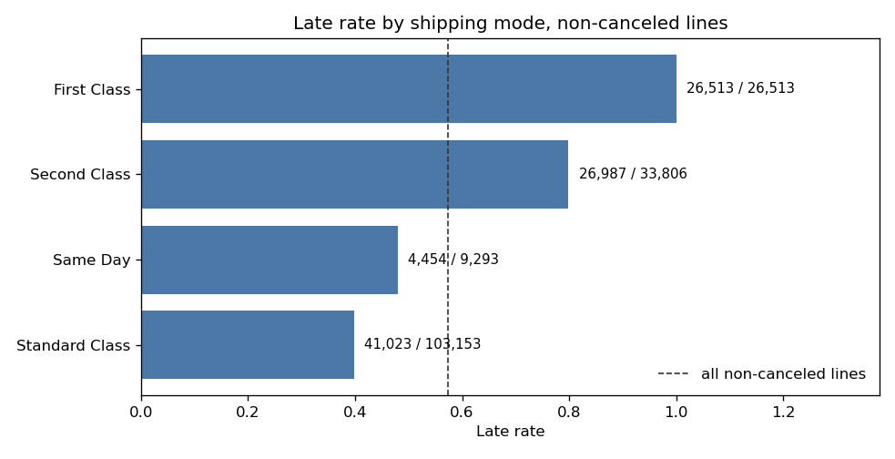

# Business report — late delivery at DataCo

This report is for a fulfillment lead. The two-minute page is [04-execute.md](04-execute.md). Nothing here refits a model, nothing here sets a threshold, and nothing here is a dollar saving.

## Question

Which orders miss the date the customer was promised, and do the misses sit in a shipping mode, a region, or a product category?

The person who can still change the outcome is the person who sets the shipping promise, not a model that scores the line after the mode is already chosen.

## What "late" means

A row in the file is an order line. The KPI population is lines whose `Delivery Status` is not `Shipping canceled`. A cancel did not keep or break a delivery promise, so it is not in the denominator.

Late is `Late_delivery_risk` = 1. On this population that flag matches real days greater than scheduled days on every line. On-time is the complement: the line was not flagged late.

| KPI | Definition | Result |
|---|---|---|
| Population | Non-canceled lines | 172,765 |
| Late lines | Flag = 1 | 98,977 |
| On-time lines | Flag = 0 | 73,788 |
| Late rate | Late lines / population | 98,977 / 172,765 = 0.5728996035076549 |
| On-time rate | On-time lines / population | 73,788 / 172,765 = 0.4271003964923451 |
| Schedule slip | Real days minus scheduled days | Median **1** on the pooled lines |

The pooled median is a mixture. It is not the median of any shipping mode. Lead with the mode table, not with "usually one day late."

## The mode table

Sorted by late rate. The line count sits beside the rate because Standard Class has the most late lines and the lowest rate.

| Shipping Mode | Lines | Late lines | Late rate | Median slip | Scheduled days | Median real days |
|---|---:|---:|---:|---:|---:|---:|
| First Class | 26,513 | 26,513 | 1.0 | 1 | 1 | 2 |
| Second Class | 33,806 | 26,987 | 0.7982902443353251 | 2 | 2 | 4 |
| Same Day | 9,293 | 4,454 | 0.47928548369740664 | 0 | 0 | 0 |
| Standard Class | 103,153 | 41,023 | 0.39769080879858076 | 0 | 4 | 4 |

26,513 + 33,806 + 9,293 + 103,153 = 172,765. Late lines sum to 98,977.

First Class does not vary. The promise is 1 day. Delivery is 2 days on every non-canceled First Class line, so slip is 1 and the flag is 1. There is no on-time First Class line to find.

Second Class promises 2 days. The median line takes 4, so median slip is 2. Late is 26,987 / 33,806.

Same Day promises 0 days. Median slip is 0, because 4,454 late lines are under half of 9,293. When a Same Day line misses, it misses by one day.

Standard Class promises 4 days. Median real days are 4, so median slip is 0. The typical Standard Class line meets the promise. It is still 41,023 late lines, the largest late count in the file, at rate 0.39769080879858076.

The same four rows are in [dashboards/late_delivery_dashboard.html](../dashboards/late_delivery_dashboard.html), which opens in a browser. The file it is built from is `data/processed/mode_scorecard.csv`.

## Region and category do not move the rate

Once the shipping mode is fixed, region is not a second program.

First Class is late in all 23 regions and all 5 markets. Median slip is 1 day in every region, and median lead time is 3 days in every region. That median does not rank places. It is the pool.

Inside a mode, the five markets barely separate. First Class is 1.0 in every market. Standard Class runs from LATAM 11,790 / 29,812 = 0.3954783308734738 to Pacific Asia 9,459 / 23,630 = 0.4002962336013542. None of those gaps looks like the gap between First Class (1.0) and Standard Class (0.39769080879858076).

A region-level check asks whether a region's late rate is just its mix of modes. The largest absolute gap between the actual rate and the rate implied by that mix is Canada: actual minus implied **−0.06522236464088049**, on **907** lines. Canada's First Class lines are still all late. That gap is not a reason to stand up a regional program. The source table is `data/processed/region_rate_vs_mode_mix.csv`.

Category is the same negative result. Median slip is 1 for 49 of 50 categories. The exception is Men's Golf Clubs, 135 / 274 late, median slip 0, on 274 lines. The largest categories sit on the overall rate. Cleats is 13,496 / 23,514 = 0.5739559411414477. A category manager who starts with the highest rate, Golf Bags & Carts at 42 / 61, is starting with 61 lines.

## What the models did

On orders held out of training (19,722 late lines out of 34,272 test lines), a logistic regression and a random forest that also saw region, category, customer segment, the order's month and weekday, quantity, price, and discount did not beat a baseline that only knows the shipping mode. Test ROC AUC is 0.7383939473457695 for the mode baseline, 0.736119769260069 for logistic regression, and 0.7347929101103273 for the forest. Flagging the same share of lines (19,613 of 34,272), the mode catches 13,828 late lines, logistic 13,790, and the forest 13,762. Inside Second Class, Same Day, and Standard Class, where the flag still varies, the models do not rank late lines. The forest puts 0.9308387729436968 of its impurity importance on shipping mode and 0.006610455290712629 on category. The models lost to the mode rule.

## Recommendation

Fix the First Class promise or the operation that delivers it. The promise is 1 day and delivery is 2 days on every non-canceled First Class line (26,513 / 26,513). Second Class is the other mode to manage: 26,987 / 33,806 late, median slip 2 days. Do not deploy a classifier. Do not set an operating threshold on the logistic model or the random forest. They did not beat the shipping-mode baseline.

A dollar penalty for a late day is not in the file. Dollar impact is not estimated. Do not invent one.

## How this was delivered

Plan locked the late definition and refused a dollar impact before any rate was computed ([01-plan.md](01-plan.md)). Analyze measured the scorecard and did not fit a model ([02-analyze.md](02-analyze.md)). Construct scored the two baselines, the logistic model, and the forest, and did not pick a threshold ([03-construct.md](03-construct.md)). This page says what to do with those results.

Tableau Public is the publish step. It was not done here. The extract to upload is `data/processed/mode_scorecard.csv`. This environment cannot sign into a Tableau Public account, and no public Tableau URL exists. The hiring-manager view is the HTML dashboard.
