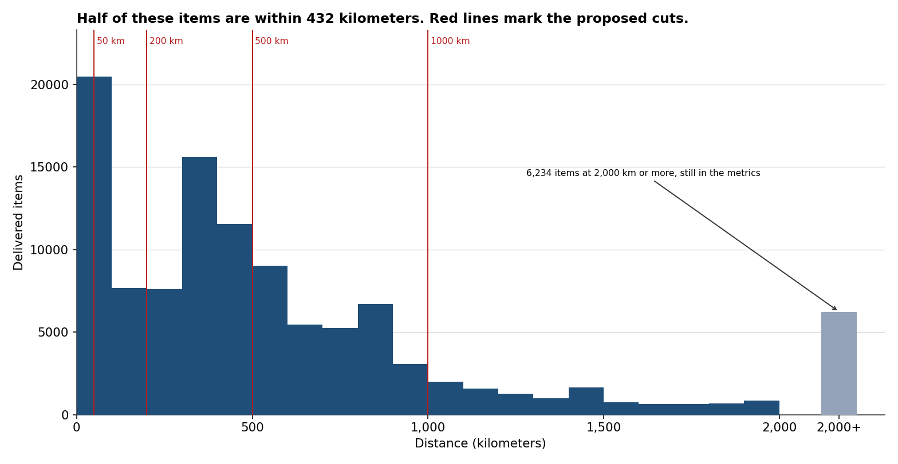
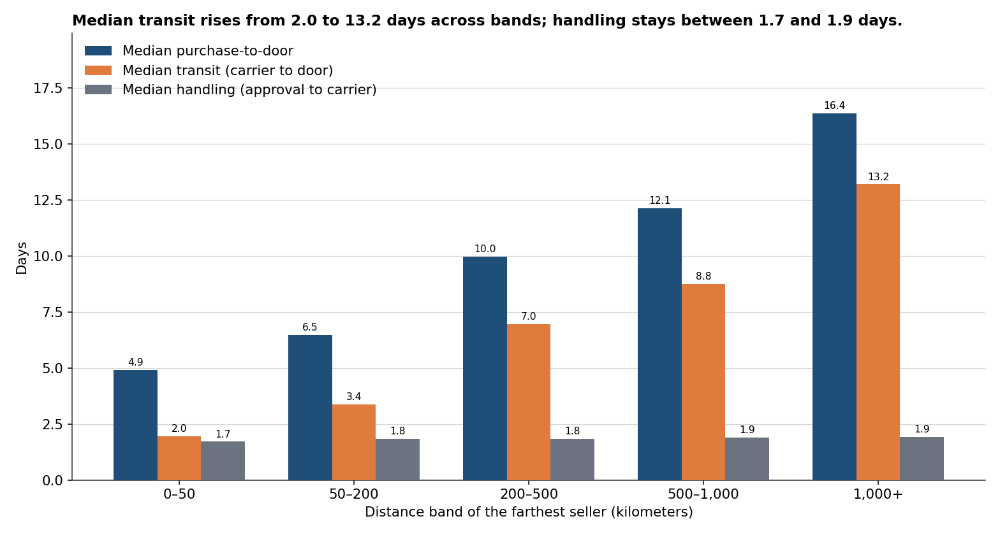
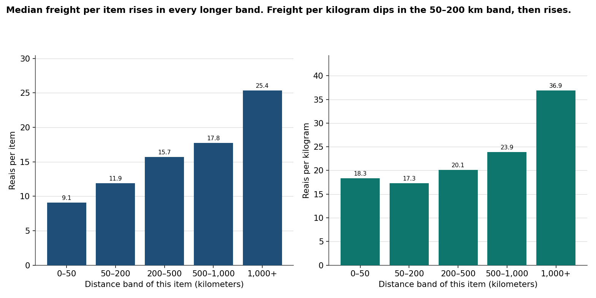
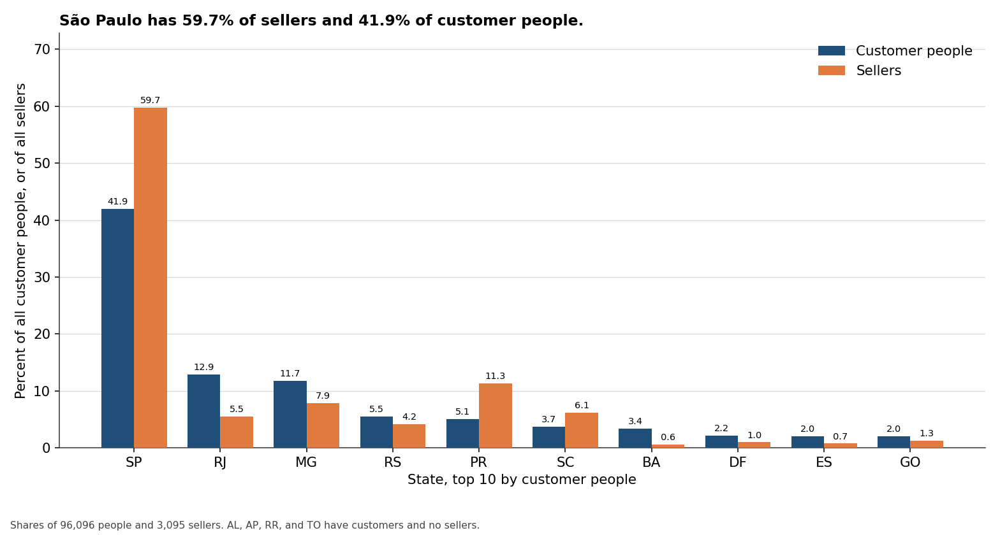

# Analyze — Logistics network and executive dashboard (Olist)

PACE stage: **Analyze**. This page checks the grain, builds distance, and states delivery time and freight next to that distance. It does not build the dashboard, freeze the distance bands, or write a recommendation. Those belong to Construct and Execute.

The checks below are what [the plan](01-plan.md) said Analyze would confirm. Every figure comes from `src/analyze_logistics.py` run on the local raw files (not re-downloaded). The joins and the KPI filters are the SQL in `sql/kpi_analyze.sql`. Aggregate tables are in `data/processed/`. Charts are in `images/`. The raw CSVs stay git-ignored. Purchase timestamps in the file have no timezone, so they are reported as stored.

Currency is Brazilian reais. Nothing here is converted.

## How I would say this in an interview

Leadership is not asking for a map. They are asking whether customers and sellers sit in the same places, and whether a longer haul shows up as a slower delivery and a higher freight bill. Those questions do not share a row.

There are **96,096 customer people** and **99,441 orders**. Counting `customer_id` would have counted orders. Sellers are **3,095** people-or-firms in the seller table, in **23** states. Customers sit in **27**. São Paulo is 41.9% of the people (40,302 / 96,096) and 59.7% of the sellers (1,849 / 3,095). Rio de Janeiro is the other way around: 12.9% of the people and 5.5% of the sellers. Paraná is seller-heavy: 5.1% of the people and 11.3% of the sellers. Four states have customers and no seller at all.

On the items that were actually delivered, **70,328 of 110,189 cross a state line**. That is 63.8%.

Olist does not publish a distance. The geolocation file has 1,000,163 points and 19,015 zip prefixes. I took the mean latitude and mean longitude of each prefix first, then the haversine kilometers between the customer prefix and the seller prefix, with earth radius 6,371. That is great-circle distance, not the road and not the carrier's bill. The median item distance is **432 km**. The mean is **596 km**. The shape is skewed, with a tall pile under 100 km and a long tail, so the bands below are round cuts near the percentiles. They are a proposal. Construct freezes them.

On **96,470 delivered orders** the median purchase-to-door time is **10.2 days** and the mean is **12.6**. Median transit, carrier to door, is **7.1 days**. Median handling, approval to carrier, is **1.8 days**. Across the bands, handling stays between 1.7 and 1.9 days. Transit goes from 2.0 days under 50 km to 13.2 days at 1,000 km or more. The extra wait shows up in transit, not in seller handling. That is a description of these orders. It is not a claim that kilometers caused the wait.

Median freight per item is **R$16.26**, and it rises in every longer band, from R$9.06 to R$25.38. Median freight per kilogram is **R$22.22**. It does not rise in the second band. Weight is doing some of the work, which is why freight per kilogram is on the page at all.

Delivered on or before the promised calendar date: **89,936 / 96,470 = 93.2%**. The longest band is still 89.6% on time while the median wait there is 16.4 days. The promise moves. Days and the rate are both required. A timestamp compare would have called 1,292 same-day deliveries late, because every estimate in this file is stored at midnight.

Only 1,275 of the 96,470 delivered orders have more than one seller. The farthest-seller rule changes the distance band for 558 of them. It does not change the overall median days, because that median does not use distance.

## What was checked

The plan's ten checks, then the relationships those checks justify.

1. Row counts against `data/README.md`, from the nine CSVs.
2. People versus orders versus sellers, and the share of orders with more than one seller.
3. `order_status`, null door timestamps, and any door timestamp on or before purchase.
4. Minimum and maximum `order_purchase_timestamp`. Not assumed.
5. Zip prefixes with no centroid after the collapse, with and without zero-padding.
6. Item rows before and after the geolocation join. The join must not grow.
7. Centroid coordinates outside a loose Brazil box. Counted, not dropped.
8. Null and non-positive freight, price, and weight.
9. Null `order_estimated_delivery_date` on the delivered population.
10. The distribution of item distance, and a proposed set of bands.

No dashboard.

## 1. Shape

Read with the csv module, so a quoted line break is not a second row. The translation file has a byte-order mark on its header. The row count does not change if that mark is stripped. Reviews, payments, and the translation were counted and not loaded. They are out of scope.

| File | Rows | Columns | Matches `data/README.md` |
|---|---:|---:|---|
| `olist_customers_dataset.csv` | 99,441 | 5 | Yes |
| `olist_geolocation_dataset.csv` | 1,000,163 | 5 | Yes |
| `olist_order_items_dataset.csv` | 112,650 | 7 | Yes |
| `olist_order_payments_dataset.csv` | 103,886 | 5 | Yes |
| `olist_order_reviews_dataset.csv` | 99,224 | 7 | Yes |
| `olist_orders_dataset.csv` | 99,441 | 8 | Yes |
| `olist_products_dataset.csv` | 32,951 | 9 | Yes |
| `olist_sellers_dataset.csv` | 3,095 | 4 | Yes |
| `product_category_name_translation.csv` | 71 | 2 | Yes |

99,441 + the rest is an inventory, not a finding. The script stops if a key that should be unique is not: `order_id`, `customer_id`, `seller_id`, and `product_id` are unique. Duplicate `(order_id, order_item_id)` pairs: **0**.

## 2. Grain

| Check | Result |
|---|---|
| Orders | **99,441** |
| Distinct `customer_id` | **99,441** (one row per order) |
| Distinct `customer_unique_id` (people) | **96,096** |
| People with more than one order | **2,997** (maximum 17 orders) |
| People in more than one state | **39** (38 in two states, 1 in three) |
| Sellers | **3,095**, in **23** states |
| Customer states | **27** |
| Items | **112,650** |
| Orders with at least one item | **98,666** |
| Orders with no item | **775** |
| Orders with more than one seller, among orders that have an item | **1,278 / 98,666** |
| Same share on the delivered population | **1,275 / 96,470** |
| Items whose order, customer, or seller is missing | **0** |
| Sellers in the seller table with no item | **0** |

`customer_id` is the order's customer row. `customer_unique_id` is the person. The state picture counts people. A person in two states is counted in each, so the state counts sum to **96,136**, which is 96,096 + 40 extra state links (38 + 2). Demand counts orders, and each order has one state, so the order counts sum to 99,441.

The 775 orders with no item are not delivered. They cannot have a seller distance or a freight line. Their statuses are in section 3.

Multi-seller is rare. Of the 95,992 delivered orders that have a distance, **558** would sit in a different band if delivery time used the nearest seller instead of the farthest. All 558 are multi-seller orders (558 / 1,269 multi-seller orders that have both a minimum and a maximum distance). The farthest-seller rule stays, because Plan locked it and because 558 orders are not a reason to redraw the chart. Freight never uses that maximum. Each item keeps its own distance and its own `freight_value`.

The overall median purchase-to-door days does not use distance, so the farthest-versus-nearest choice cannot move it.

## 3. Status, null door times, and time order

| `order_status` | Orders | Door timestamp missing | Door timestamp present |
|---|---:|---:|---:|
| delivered | 96,478 | 8 | 96,470 |
| shipped | 1,107 | 1,107 | 0 |
| canceled | 625 | 619 | 6 |
| unavailable | 609 | 609 | 0 |
| invoiced | 314 | 314 | 0 |
| processing | 301 | 301 | 0 |
| created | 5 | 5 | 0 |
| approved | 2 | 2 | 0 |
| All orders | 99,441 | 2,965 | 96,476 |

96,478 + 1,107 + 625 + 609 + 314 + 301 + 5 + 2 = 99,441.

The population for time and freight is `order_status = 'delivered'`, a door timestamp present, and that timestamp **after** the purchase timestamp.

| Exclusion | Orders |
|---|---:|
| Delivered, door timestamp missing | **8** |
| Delivered, door timestamp on or before purchase | **0** |
| Not delivered, but a door timestamp is present | **6**, all `canceled` |
| Population that remains | **96,470** |

96,478 − 8 = 96,470. No delivered order has a door time on or before purchase, so the "after purchase" rule removes nobody beyond the 8 nulls. The 6 canceled orders with a door timestamp stay out. A cancel is not a completed delivery.

Orders with no item, by status. None of these are in the population.

| `order_status` | Orders with no item |
|---|---:|
| unavailable | 603 |
| canceled | 164 |
| created | 5 |
| invoiced | 2 |
| shipped | 1 |
| All | 775 |

603 + 164 + 5 + 2 + 1 = 775. Every delivered order has at least one item.

The population is **110,189 items** on those 96,470 orders.

## 4. Purchase-date window

The file does not mark a timezone. These are the strings in `order_purchase_timestamp`.

| Population | Minimum | Maximum |
|---|---|---|
| All 99,441 orders | 2016-09-04 21:15:19 | 2018-10-17 17:30:18 |
| The 96,470 delivered orders | 2016-09-15 12:16:38 | 2018-08-29 15:00:37 |

Null purchase timestamps: **0**.

Orders purchased after the last delivered purchase: **26** (25 canceled, 1 shipped). The undelivered orders are not a second era at the end of the file. They sit inside this window, and they stay out of the time and freight medians because they are not completed deliveries. Construct should not treat a missing door time as a fast delivery.

## 5. Zip prefixes and the centroid

Geolocation collapses to one row per prefix before any join: **19,015** centroids from 1,000,163 points. The busiest prefix has **1,146** points. Null coordinates in the geolocation file: **0**.

Customer and seller prefixes in this extract are not zero-padded. Geolocation prefixes are 5 characters. The join pads with `printf('%05d', ...)`. That puts the leading zero back. It does not invent a coordinate for a prefix that is still absent.

| Match | Customer rows | Seller rows |
|---|---:|---:|
| Rows | 99,441 | 3,095 |
| Distinct prefixes | 14,995 | 2,246 |
| Missing a centroid, **without** padding | **24,265** | **1,033** |
| Missing a centroid, **with** padding | **279** | **8** |
| Distinct prefixes still missing after the pad | **158** | **8** |

The unpadded join is the wrong join. Plan did not spell out the pad. The data did. `sql/kpi_definitions.sql` now says so. The 279 customer rows and 8 sellers are really missing. They are not filled with a state average.

On the delivered-item population the same rule drops distance, not the item:

| Delivered items | Count |
|---|---:|
| Items | 110,189 |
| With both centroids | 109,651 |
| Missing a distance | **538** |
| Missing the customer centroid | 289 (153 distinct prefixes) |
| Missing the seller centroid | 250 (8 distinct prefixes) |
| Missing both | 1 |

289 + 250 − 1 = 538. Delivered orders with no item distance: **478**. Orders where some but not all items have a distance: **4**. Those 478 orders stay in the purchase-to-door median and the on-time rate. They are not in a distance band.

## 6. The join does not multiply items

| Check | Rows |
|---|---:|
| Items before the join | 112,650 |
| Items after the centroid join | **112,650** |
| Centroid rows | 19,015 |
| Distinct centroid prefixes | 19,015 |

If the customer side had been joined to the raw points instead of the centroid, the item table would have become **17,195,778** rows. The seller side, joined the same wrong way, would have become **16,252,304** rows. That is the fanout the centroid exists to prevent. Freight summed on the exploded table would not be freight.

## 7. Coordinates outside Brazil

The box from the plan is latitude −34 to 6 and longitude −74 to −32. A point on the boundary is inside. This stage counts and **does not drop**.

| Check | Count |
|---|---:|
| Raw geolocation points outside the box | **31** |
| Prefixes with at least one such point | **20** |
| Of those, centroid still inside the box | **10** |
| Centroids outside the box | **10** |
| Centroids with a null coordinate | **0** |
| Delivered items whose customer or seller centroid is outside the box | **8** |

The ten outside centroids are in `data/processed/centroids_outside_brazil.csv`. Their mean latitudes run from −0.48 to 42.18, and one mean longitude is 121.11. A mean can also hide a bad point: ten prefixes have an outside point and a centroid that still lands inside Brazil, because the other points pull the average back. Those were not removed either.

A second warning, also not a drop. **313** prefixes span more than 1 degree of latitude or longitude (15,937 points). **2,544** delivered items use one of those prefixes as the customer prefix or the seller prefix. Plan locked the mean. A median coordinate would resist a stray point, and this stage does not switch.

Item distances at or above 3,500 km: **7**. At or above 4,000 km: **4**. At or above 6,000 km: **1**. The maximum is **8,678 km**. They stay in the 1,000+ band. That band's median is 1,664 km, so these few points do not set the median.

## 8. Freight, price, and weight

| Check | All items (or products) | Delivered items |
|---|---:|---:|
| Freight null | 0 | 0 |
| Freight equal to 0 | **383** | **381** |
| Freight negative | 0 | 0 |
| Price null, zero, or negative | 0 | 0 |
| Product rows with null weight | **2** | — |
| Product rows with weight 0 | **4** | — |
| Product rows with negative weight | 0 | — |
| Items with null weight | 18 | **18** |
| Items with weight ≤ 0 | 8 | **8** |

Zero freight stays in the freight total and in the median freight per item. The plan said to count it, not to drop it. The median is R$16.26, so a few zeros do not decide it.

Null or non-positive weight stays in the freight total and drops out of freight per kilogram. That is **26** delivered items (18 + 8). Freight per kilogram is computed on the other **110,163**. Every one of the 538 items with no distance has a positive weight, so the 26 weight exclusions all sit inside the distance bands.

Delivered-item money, in cents from the file's two-decimal text, so the total is not a float artifact:

| Amount | Value |
|---|---|
| Total freight | 220,283,580 cents = **R$2,202,835.80** |
| Total item price | 1,322,024,893 cents = **R$13,220,248.93** |
| Median freight per item | **R$16.26** (110,189 is odd, so this is one item's freight) |
| Mean freight per item | R$19.99 (19.99143108658759) |
| Median price | **R$74.90** |
| Median freight / price | **0.232** (23.2% of the item price) |

Freight as a share of price is context. It is not a claim that price causes freight.

## 9. The estimated delivery date

Null estimates on all 99,441 orders: **0**. Null estimates on the 96,470 delivered orders: **0**. Nothing is dropped from the on-time rate for a missing promise.

Every estimate is stored at `00:00:00` (99,441 / 99,441). Comparing full timestamps would mark a delivery later on the promised day as late. That happened for **1,292** orders, which is every order delivered on the estimate's calendar day (1,292 / 1,292). The definition in `sql/kpi_definitions.sql` is now the calendar date: `date(delivered) <= date(estimated)`.

| Rule | On time | Rate |
|---|---:|---:|
| Calendar date (the KPI) | **89,936 / 96,470** | 0.9322690992018244 |
| Raw timestamp (not the KPI) | 88,644 / 96,470 | 0.9188763346117964 |

89,936 − 88,644 = 1,292. Late on the calendar rule is 96,470 − 89,936 = **6,534** (6.8%). The on-time rate is not the only time metric. Section 10 is why.

## 10. Item distance, and the bands Construct will freeze

Distance is defined on the 109,651 delivered items with both centroids. The rank quantile below is an observed kilometer: the value at rank `ceil(p × n)` in the sorted list. For this odd count, the 50% rank is the median.

| Rank | Item distance (km) | Farthest-seller distance on the order (km) |
|---|---:|---:|
| Minimum | 0 | 0 |
| 10% | 34.1 | 34.9 |
| 25% | 185.2 | 189.3 |
| 50% | 431.9 | 435.6 (see note) |
| 75% | 791.6 | 800.3 |
| 90% | 1,446.3 | 1,457.5 |
| 95% | 2,086.0 | 2,096.4 |
| 99% | 2,479.2 | 2,483.9 |
| Maximum | 8,677.9 | 8,677.9 |
| Mean | 596.3 | 602.1 |
| n | 109,651 | 95,992 |

The order-distance median used everywhere else is the average of the two central orders, because 95,992 is even: 435.6331003230282 and 435.6520789100486, average **435.64258961653843**. The 50% rank in the table is the lower of those two. They are the same kilometer at one decimal.

The histogram is not a set of equal piles. There is a tall bar under 100 km, another mass around 300 to 500 km, and a tail. **6,234** items are at 2,000 km or more. They are the grey bar on the chart, and they stay in the metrics.

**Proposed bands**, right-open, so 50 km belongs to 50–200 and not to 0–50. The last band is everything at 1,000 km or above, including the 8,678 km point.

| Cut | Why this round number |
|---|---|
| 50 km | Just above the 10th percentile (34 km). The local pile. |
| 200 km | Next to the 25th percentile (185 km). |
| 500 km | Just above the median (432 km). |
| 1,000 km | Between the 75th percentile (792 km) and the 90th (1,446 km). |
| 1,000+ | The tail. Not its own set of pretty cuts. |

These are not frozen. The distribution is too lumpy for that. Construct writes down one set and does not move it to make a chart smoother. If a different round cut is wanted, the time to say so is before Construct.

## Delivery time by distance

Order grain. The band is the farthest seller. Population: the 95,992 delivered orders with a distance. Handling and transit medians drop negative durations. Purchase-to-door does not, because the population already requires the door time to be after purchase.

| Band | Orders | Median km | Median purchase-to-door | Mean purchase-to-door | Median transit | Median handling | On time |
|---|---:|---:|---:|---:|---:|---:|---|
| 0–50 | 11,672 | 19 | 4.9 days | 6.2 | 2.0 days | 1.7 days | 11,153 / 11,672 = 95.6% |
| 50–200 | 12,832 | 103 | 6.5 | 8.0 | 3.4 | 1.8 | 12,234 / 12,832 = 95.3% |
| 200–500 | 30,258 | 355 | 10.0 | 12.1 | 7.0 | 1.8 | 28,323 / 30,258 = 93.6% |
| 500–1,000 | 25,829 | 707 | 12.1 | 14.3 | 8.8 | 1.9 | 24,000 / 25,829 = 92.9% |
| 1,000+ | 15,401 | 1,674 | 16.4 | 19.1 | 13.2 | 1.9 | 13,792 / 15,401 = 89.6% |

11,672 + 12,832 + 30,258 + 25,829 + 15,401 = 95,992.

The leg definitions, on all 96,470 delivered orders, not only the orders in a band:

| Leg | What it is | Rows used | Rows excluded | Median | Mean |
|---|---|---:|---:|---:|---:|
| Purchase-to-door | Door minus purchase | 96,470 | 0 inside the population | 10.2 days | 12.6 days |
| Approval | Approved minus purchase | 96,456 | 14 with no approval timestamp, 0 negative | 0.014 days | 0.43 days |
| Handling | Carrier minus approval | 95,105 | 15 with a missing timestamp, **1,350 negative** | 1.8 days | 2.9 days |
| Transit | Door minus carrier | 96,446 | 1 with no carrier timestamp, **23 negative** | 7.1 days | 9.3 days |

Approval's median is 0.014305555261671543 days, about 20.6 minutes. The mean is 0.43 days because a few approvals take much longer. The median is the typical order.

Negative handling is a timestamp out of order, not a duration. The worst is −171.2 days. One thousand three hundred fifty orders is 1.4% of the population. Leaving them in moves the handling median from 1.849 days to 1.816 days and the mean from 2.85 days to 2.80 days. The band story does not depend on the exclusion. They are excluded from the handling median and mean anyway, and the orders stay in purchase-to-door. Negative transit is 23 orders, the worst −16.1 days. Leaving them in moves the transit median from 7.100 days to 7.100 days. Same rule.

The three median legs do not add to the median purchase-to-door time. 0.014 + 1.8 + 7.1 is not 10.2. Medians of different rows do not add, and the leg populations are not the same rows. A dashboard that stacks the three medians into the headline would be wrong.

On time falls from 95.6% to 89.6% while median days rise from 4.9 to 16.4. Far orders are slower in days and still usually "on time." The estimate is already looser where the haul is longer. This file does not say how Olist built that estimate.

Full-precision medians, means, and the two central rows when the count is even are in `data/processed/analyze_summary.json` and `data/processed/distance_band_summary.csv`. The purchase-to-door median is the average of 10.217453703284264 and 10.217499999795109 because 96,470 is even: **10.217476851539686** days. The mean is **12.558217098051923**.

## Freight by distance, and freight per kilogram

Item grain. The band is that item's own distance, not the order's farthest seller. An order can have items in different bands. That is intentional.

| Band | Items | Median km | Median freight | Mean freight | Median R$ per kg | Median weight | Cross-state items |
|---|---:|---:|---:|---:|---:|---:|---|
| 0–50 | 13,449 | 19 | R$9.06 | R$11.53 | R$18.33 | 500 g | 41 / 13,449 = 0.3% |
| 50–200 | 14,708 | 103 | R$11.92 | R$13.82 | R$17.27 | 610 g | 1,294 / 14,708 = 8.8% |
| 200–500 | 34,748 | 354 | R$15.70 | R$19.09 | R$20.13 | 800 g | 22,772 / 34,748 = 65.5% |
| 500–1,000 | 29,495 | 705 | R$17.75 | R$21.12 | R$23.88 | 710 g | 28,501 / 29,495 = 96.6% |
| 1,000+ | 17,251 | 1,664 | R$25.38 | R$31.70 | R$36.92 | 650 g | 17,251 / 17,251 = 100% |

13,449 + 14,708 + 34,748 + 29,495 + 17,251 = 109,651.

The 538 items with no distance are not in this table. Their freight is R$11,609.26 (1,160,926 cents), inside the R$2,202,835.80 total and outside the chart.

Freight per kilogram is `freight_value / (product_weight_g / 1000)` on each item. The median of those ratios is R$22.22 (22.215384615384615) on 110,163 items. The mean of the ratios is R$39.33 (39.33086612196559). That mean is the wrong headline: the lightest positive weight is **2 grams**, and the highest ratio is **R$19,800 per kg**. A 2 gram item with a normal freight bill looks expensive per kilogram.

The other average, total freight on the positive-weight items divided by total kilograms, is 2,202,383.64 reais / 230,222.996 kg = **R$9.57 per kg** (9.566306052241627). Heavy goods dominate that number. It is not the median, and it is not what the plan defined. It is here so the R$39.33 mean is not quoted as the cost of moving a kilogram.

The 50–200 km band is the one place median freight per kilogram falls (R$18.33 to R$17.27) while median freight per item rises. The median item in that band is heavier (610 g versus 500 g). That is consistent with a weight mix. It is not a rate card, and it is not a reason to drop the per-kilogram column. Past that band, both the item freight and the per-kilogram freight are higher in every longer band.

## Cross-state

Among delivered items with both a customer state and a seller state: **70,328 / 110,189 = 0.6382488270154009**. Missing either state: **0**.

Same-state items with a distance: 39,792. Their median distance is **97 km** (the two central values average to 96.709361). Cross-state items with a distance: 69,859. Their median distance is **654 km**. The longest same-state item distance in this file is **927 km**, so the 1,000+ band is entirely cross-state. That is a fact about these centroids. It is not a claim that a state cannot be 1,000 km across.

Short bands are mostly inside one state (0.3% cross-state under 50 km). That is the same pattern as the distance, not a second cause.

## Where customers and sellers sit

People and orders are the whole customer table, not only delivered orders. The largest gap between a state's share of all orders and its share of delivered orders is **0.12 percentage points**, in Rio de Janeiro. The delivered mix is not a different map. Sellers are the seller table. Of those 3,095, **2,970** appear on a delivered item. São Paulo is 1,769 / 2,970 = 59.6% of sellers with a delivered item, against 1,849 / 3,095 = 59.7% of the seller table. The mismatch is not an artifact of sellers who never delivered.

Top 10 states by customer people. Shares use 96,096 people and 3,095 sellers as the denominators.

| State | People | Share of people | Orders | Share of orders | Sellers | Share of sellers |
|---|---:|---:|---:|---:|---:|---:|
| SP | 40,302 | 41.9% | 41,746 | 42.0% | 1,849 | 59.7% |
| RJ | 12,384 | 12.9% | 12,852 | 12.9% | 171 | 5.5% |
| MG | 11,259 | 11.7% | 11,635 | 11.7% | 244 | 7.9% |
| RS | 5,277 | 5.5% | 5,466 | 5.5% | 129 | 4.2% |
| PR | 4,882 | 5.1% | 5,045 | 5.1% | 349 | 11.3% |
| SC | 3,534 | 3.7% | 3,637 | 3.7% | 190 | 6.1% |
| BA | 3,277 | 3.4% | 3,380 | 3.4% | 19 | 0.6% |
| DF | 2,075 | 2.2% | 2,140 | 2.2% | 30 | 1.0% |
| ES | 1,964 | 2.0% | 2,033 | 2.0% | 23 | 0.7% |
| GO | 1,952 | 2.0% | 2,020 | 2.0% | 40 | 1.3% |

States with customers and no seller:

| State | People | Orders | Sellers |
|---|---:|---:|---:|
| AL | 401 | 413 | 0 |
| TO | 273 | 280 | 0 |
| AP | 67 | 68 | 0 |
| RR | 45 | 46 | 0 |

401 + 273 + 67 + 45 = 786 people. 413 + 280 + 68 + 46 = 807 orders. All 27 customer states and all 23 seller states are in `data/processed/state_summary.csv`. The chart is the top 10 because that is where the mismatch is large enough to see.

This is a coverage picture. It is not a site-selection model. A centroid is not a warehouse.

## What is not claimed

- Distance is not shown to cause a longer transit or a higher freight bill. The bands are a cross-section. Product mix, the day of the week, and the way the promise was set can all move with distance. There is no carrier name in the file.
- Seller handling is flat across these bands. That does not prove sellers are fast. It proves the extra days in the longer bands are not sitting in the handling leg.
- The on-time rate does not measure speed. A 16-day delivery can be on time.
- Haversine kilometers are not road kilometers and not what the carrier charges.
- The mean centroid is wrong for a prefix whose points are not one place. Three hundred thirteen prefixes span more than a degree. They were left in on purpose.
- Ten centroids sit outside Brazil, and eight delivered items use one. They were left in. They do not set the medians. They do set the maximum.
- The mean of freight-per-kilogram ratios is not the cost per kilogram shipped. The median is the typical item. Total freight divided by total kilograms is a different number, R$9.57, and it is not the KPI.
- No reais were converted to dollars. No review score was computed. No warehouse was recommended.

## What Construct will build

Construct freezes the five bands above, unless a different round cut is chosen before that work starts. It does not retune them after seeing the chart.

The weekly page is the seven lines from the plan, on these definitions:

1. Orders purchased that week, from `order_purchase_timestamp`. Not only delivered orders.
2. Median purchase-to-door days, and median transit days, on the delivered population.
3. On-time rate by calendar date, next to the median days. Not instead of them.
4. Total freight and median freight per item, in reais.
5. Cross-state share of delivered items.
6. One distance-band table: order count, median purchase-to-door, median transit, median freight per item. Time uses the farthest seller. Freight uses the item.
7. Customers by state next to sellers by state.

The page is shaped like a weekly review of a historical extract. It is not a live feed. A week of purchases that have not been delivered does not get a door time of zero.

Tableau Public is the tool, and it starts at Construct. The SQL in `sql/kpi_analyze.sql` is the definition the page should read. A number that exists only in a notebook will drift.

Not in Construct: a routing model, a warehouse solver, a regression leaderboard, review text, payments, or a currency conversion.

## Decisions left

None that block Construct.

The band edges are the one choice that is still a proposal. The pattern Construct would be freezing is already visible: transit rises, handling does not, freight per item rises, freight per kilogram is not a straight line. Say so before Construct if the cuts should be different. Otherwise those five cuts stand, and they are not moved later to make a bar chart smoother.

The out-of-Brazil centroids and the wide prefixes stay in. There are 8 affected delivered items for the box and 2,544 for the wide-prefix flag. Dropping them would be a different metric, and it was not done here.

Execute is not done in this file. There is no recommendation and no impact estimate yet.
